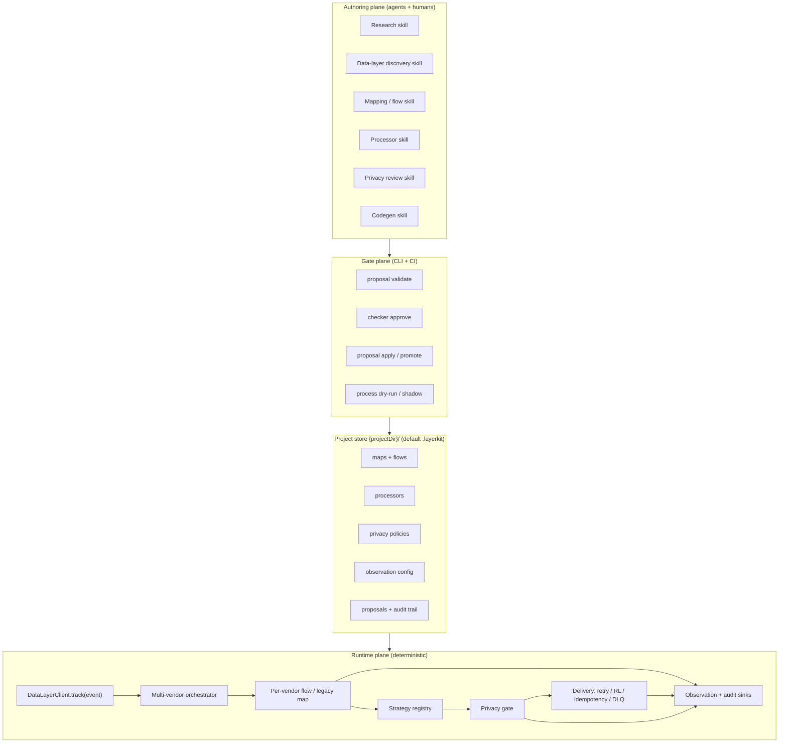
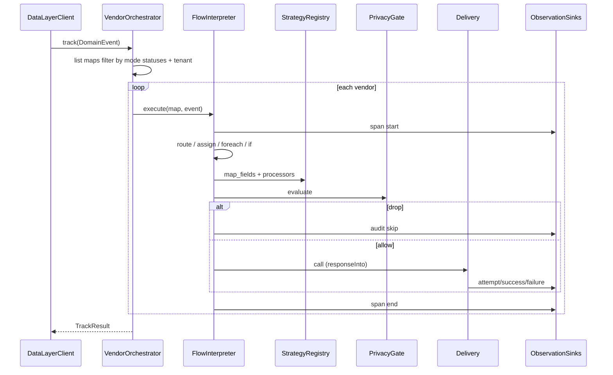
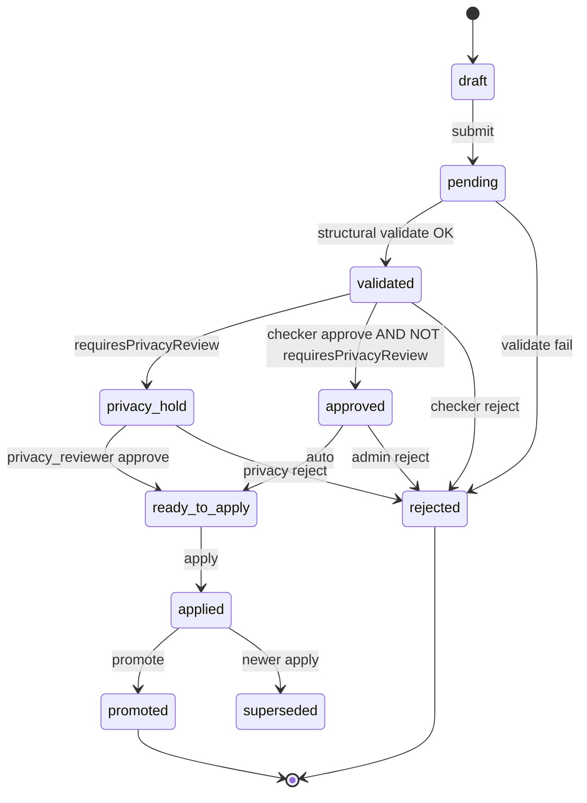
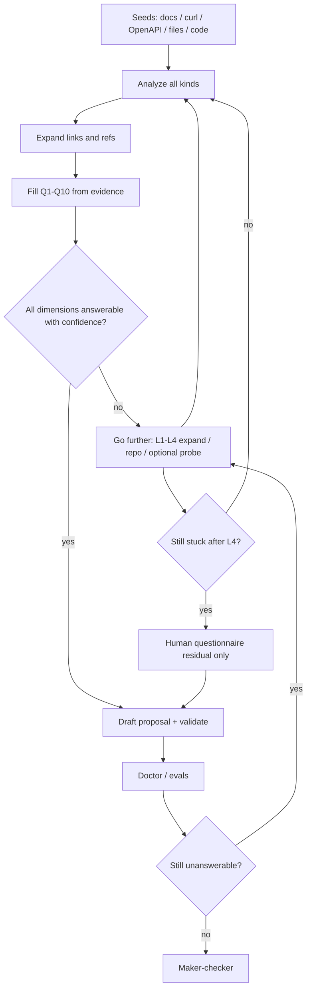

# Layerkit Production Multi-Vendor Data-Layer Integration Platform Redesign

| Field | Value |
|-------|--------|
| **Document** | Layerkit Production Redesign |
| **Author** | Layerkit maintainers (drafted from codebase review) |
| **Date** | 2026-07-25 |
| **Revised** | 2026-07-26 (rev 8 — production eval system as core merge bar) |
| **Status** | Draft — implementation-ready |
| **Package** | `layerkit` v0.1.0 → v0.2+ (evolutionary) |
| **Repo** | `/Users/pallavisahoo/Documents/layerkit` (github.com/hariharapanigrahy/layerkit) |

---

## Overview

Layerkit is an agent-first multi-vendor data-layer toolkit: coding agents research vendor documentation and author maps/processors; the CLI installs, gates, stores, and evals; generated enterprise clients run deterministic `track()` with **no LLM on the hot path** (`docs/AGENT_FIRST.md`, `README.md`).

Today the package is a **working philosophy with a thin skeleton**. Core types live in `libs/domain/types.ts` and `libs/domain/commerce.ts`; maps are flat (`VendorMap` with single `endpoint`, intent→eventName, field rows); `DomainEvent` lives in `libs/vendor-memory/map-engine.ts` (not domain types); map-engine path-maps only and does not execute processors; `libs/proposal/validate.ts` is structural single-step validate/apply and hard-requires `schemaVersion === 1`; Java generation (`libs/generate/java-scaffold.ts`) emits `pom.xml` + `AGENT_TASK.md` only; observation, privacy, control-flow, secrets, retries, and dual approval are absent.

This design evolves Layerkit into a **production integration platform + agent toolkit** for companies whose data layer must fan out to many vendors—each with different contracts, formats, privacy rules, and delivery semantics—while preserving the agent-first install/eval philosophy and deterministic runtime. **Production readiness is defined by a green deterministic eval system** (`eval:ci` / `eval:all`), not by demos or platform smokes alone (see **Production Eval System**).

---

## Background & Motivation

### Current state (v0.1)

| Area | Path | Behavior |
|------|------|----------|
| Domain | `libs/domain/types.ts` | `VendorMap`, `Proposal`, `ProcessorSpec`, `FieldMapRow`, `IntentWire`, `AuthType` (includes `oauth2_client_credentials`) |
| Domain event | `libs/vendor-memory/map-engine.ts` | `DomainEvent` interface (not yet in domain package) |
| Commerce catalog | `libs/domain/commerce.ts` | 7 intents; singular `product.id`; 20 empty `VENDOR_SLOTS` with docs URLs |
| Map engine | `libs/vendor-memory/map-engine.ts` | Path get/set; empty skip `empty_map_awaiting_agent_research`; processors → `{ __processor, value }` placeholders |
| Store | `libs/vendor-memory/store.ts` | **Hardcoded** `join(repoRoot, '.layerkit')` today; redesign makes this path **configurable** (default still `.layerkit`) |
| Proposal gate | `libs/proposal/validate.ts` | Structural + `sources[]`; **`schemaVersion` must be `1`** |
| CLI | `apps/cli/main.ts` | install, doctor, map, proposal validate/apply, process dry-run, generate java, hooks |
| Java | `libs/generate/java-scaffold.ts` | Scaffold only (`pom.xml` + `AGENT_TASK.md`) |
| Skills | `skills/layerkit-*` | bootstrap, research-vendor, author-processor, generate-java, update-maps |
| Config | `libs/config/layerkit-config.ts` | **User-global** `~/.layerkit/config.json` (hooks, auto-map-updates, java package) |
| Evals | `evals/cases/*` | sources, empty-map skip, install platforms, sample-meta-map-apply (applies `pending`), processor citation |
| Install skills | `libs/install/skills.ts` | `copySkillsTo` installs **all** packaged skills; `SKILL_NAMES` is documentation-only |

### Pain points for production multi-vendor use

1. **Contract diversity**: Real vendors differ by endpoint per intent, batch vs single, auth schemes, and payload envelopes. A single `endpoint` + flat `fields[]` cannot express Meta CAPI vs Google Ads click upload vs Klaviyo events.
2. **Control flow**: Fan-out over cart lines, conditional routing, multi-step APIs (token then post) require route / forEach / if-else / **response capture**—not expressible today.
3. **Strategy/processors**: Processors are metadata only; dry-run does not execute them (`map-engine.ts` lines 64–72); Java has no registry.
4. **Privacy**: No gate before egress; consent, redaction, hashing, and regional rules are not modeled.
5. **Maker-checker**: `proposal validate` → `proposal apply` is single-actor. Skills document that path. Eval `sample-meta-map-apply` applies `pending` proposals. No checker role or privacy review.
6. **Observation/audit**: No pluggable sinks; project-level vs user-global config not separated for telemetry.
7. **Ops**: Auth rotation, retries, rate limits, idempotency, DLQ, schema versioning, shadow mode, secrets—unmodeled.
8. **Data-layer alignment**: No first-class discovery of the team's existing event model; agents only research vendors.

---

## Goals & Non-Goals

### Goals

1. Extend the domain model so multi-endpoint, multi-intent, multi-contract vendor integrations are configuration-first.
2. Introduce an **Integration Flow DSL** (declarative plan) supporting routing, loops, conditionals, **variable assignment, and HTTP response capture**; validated by CLI; executed deterministically in TS dry-run and (later) generated Java.
3. Ship a **Strategy/Processor registry** with citations, dry-run parity, fail-closed unresolved processors, and code generation hooks.
4. Enforce a **Privacy Gate** before any **live** vendor egress, config-driven and reviewable.
5. Implement **maker-checker** (roles, states, CLI, optional CI) without breaking existing evals/skills on day one of the state machine.
6. Provide **pluggable observation + audit** configured to the client's tech stack—not a fixed Layerkit backend (v0.2 ships a minimal sink set).
7. Expand **agent skills** into multi-role workflows without blowing hook context limits.
8. Deliver a **production Java runtime path** (primary) with TypeScript parity for dry-run/eval; keep no-LLM hot path.
9. Migrate from v0.1 types/store/CLI without breaking install platforms, empty-map philosophy, or eval gates.
10. Incremental **PR Plan** that is independently reviewable and keeps `npm test` + **`eval:all`** green.
11. Treat **evals as a core product surface** (not a demo afterthought): every production subsystem lands with deterministic CI gates so the package is **production-ready**, not demo-ready.

### Non-Goals

- LLM inference inside `track()` / production event path.
- Becoming a hosted SaaS CDP or replacing Segment/RudderStack as a managed service.
- Guaranteeing complete maps for all 20 vendors out of the box.
- Full multi-language runtime parity in v0.2 (Java + TS dry-run first; Python later).
- Replacing enterprise secrets managers (integrate via reference/env).
- **gRPC / non-HTTP transports in v0.2** (HTTP(S) only; wording must not claim gRPC).
- **CEL / freeform expressions in v0.2** (structured predicates only; CEL deferred to v0.3).
- **Live multi-instance distributed idempotency store in v0.2** (interface + local defaults only).
- **Datadog / S3 / JDBC observation sinks in v0.2** (interfaces reserved; implement later).
- Embedding OPA, Apache Camel, or Temporal as the flow runtime.
- **Requiring live LLM API calls in default CI** (agent transcript judges are optional/nightly; production merge bar is deterministic).

---

## Proposed Design

### High-level architecture



**Invariant**: Agents author knowledge artifacts as proposals with `sources[]`. Infrastructure validates, dual-approves (when enabled), stores, and generates. Runtime only executes validated configuration.

### Layered package evolution

```text
libs/
  domain/           # types v1|v2, commerce (+ products[]), DomainEvent re-export
  vendor-memory/    # store, map-engine, migrate, flow-engine
  proposal/         # validate dual-schema + maker-checker state machine
  privacy/          # gate evaluation
  strategy/         # processor registry + builtins + agent processors
  observation/      # sink interfaces + v0.2 sinks (noop, stdout, file)
  memory/           # markdown memory stack (append, index, list/show)
  delivery/         # retry, rate-limit, idempotency interface, DLQ models
  generate/         # java scaffold → phased runtime generator
  config/           # user-global ~/.layerkit + project security.reviewers
  install/          # platforms + skills (copySkillsTo unchanged)
  agent-runner/
  hooks/            # short guidance string
apps/cli/
skills/
catalog/vendors/    # draft hints only — not trusted without customer re-verify
evals/              # PRODUCTION CORE — gates + fixtures + harness (see Production Eval System)
  harness/          # runner, assert, temp project, rubric types
  fixtures/         # openapi, curl, meta, privacy, flows, java-ref
  gates/            # deterministic CI cases (merge bar)
  agent/            # optional LLM/agent judges (nightly / manual)
  suites.json       # suite → case ids for eval:all / eval:ci / eval:nightly
```

**Rule:** feature code without a matching gate in the same PR is incomplete. Demo scripts are not a substitute.

---

## Extended Domain Model

### Schema versioning

All durable artifacts carry optional or explicit `schemaVersion`. **Missing or `1` = v1 rules forever on read.**

```typescript
export type ArtifactSchemaVersion = 1 | 2;

export interface VersionedArtifact {
  schemaVersion?: ArtifactSchemaVersion; // missing ≡ 1
}
```

#### Proposal validation matrix (normative)

| Field | v1 (`schemaVersion` missing or `1`) | v2 (`schemaVersion: 2`) |
|-------|-------------------------------------|-------------------------|
| `schemaVersion` | must be `1` or omitted (treat as 1) | must be `2` |
| `id`, `kind`, `summary`, `payload` | required | required |
| `sources[]` with http(s) URLs | required | required |
| `status` | `pending\|validated\|applied\|rejected` | full state machine (see Maker-Checker) |
| `maker` | optional (default `{type:'agent', id:'unknown'}`) | required on submit |
| `checks[]` | ignored if present | required non-empty before apply when maker-checker strict |
| `requiresPrivacyReview` | default inferred at validate | explicit or inferred |
| `baseArtifactVersion` | optional | required when patching existing artifact |

```typescript
// libs/proposal/validate.ts — dual-read contract
export function validateProposal(proposal: Proposal): ValidationIssue[] {
  const ver = proposal.schemaVersion ?? 1;
  if (ver !== 1 && ver !== 2) {
    return [{ level: 'error', code: 'schema', message: 'schemaVersion must be 1 or 2' }];
  }
  // shared: id, kind, summary, sources, payload
  // if ver === 1: legacy status set only
  // if ver === 2: allow extended statuses; maker required if status !== 'draft'
  // ...
}
```

**Existing fixtures** (`schemaVersion: 1`) remain valid indefinitely. New maker-checker fields appear only on v2 proposals.

### Domain event (client data layer contract)

**Move** `DomainEvent` from `libs/vendor-memory/map-engine.ts` → `libs/domain/types.ts` (or `libs/domain/event.ts`).  
**Re-export** from `map-engine.ts` for one minor version so existing imports keep working:

```typescript
// libs/vendor-memory/map-engine.ts
export type { DomainEvent } from '../domain/types.js';
```

```typescript
export interface DomainEvent {
  intent: string;
  eventId?: string;
  occurredAt?: string;
  user?: Record<string, unknown>;
  product?: Record<string, unknown>;
  products?: Record<string, unknown>[]; // line items for foreach
  value?: Record<string, unknown>;
  context?: Record<string, unknown>;
  consent?: ConsentContext;
  region?: string;
  tenantId?: string;
  [key: string]: unknown;
}

export interface ConsentContext {
  purposes: string[];
  lawfulBasis?: string;
  gpc?: boolean;
  doNotSell?: boolean;
}
```

### Commerce domain extension

Extend `COMMERCE_DOMAIN` (bump description/version to `1.1.0`) with line-item fields. Keep singular `product.*` for PDP intents.

```typescript
// additions to libs/domain/commerce.ts fields[]
{ path: 'products', type: 'array', description: 'Cart/checkout line items' },
{ path: 'products[].id', type: 'string', description: 'Line item SKU' },
{ path: 'products[].quantity', type: 'number', description: 'Qty' },
{ path: 'products[].price', type: 'number', description: 'Unit price' },
{ path: 'consent.purposes', type: 'array', description: 'Consent purposes' },
{ path: 'region', type: 'string', description: 'Processing region' },
{ path: 'tenantId', type: 'string', description: 'Tenant id when multi mode' },
```

Foreach validation: if domain is known and `itemsPath` is not in domain inventory, **warn**; if domain marks path as non-array, **error**.

### Canonical ProposalKind (single union)

```typescript
export type ProposalKind =
  | 'vendor_map'
  | 'processor'
  | 'field_row'
  | 'intent_wire'
  | 'auth'
  | 'java_artifact'
  | 'flow'
  | 'privacy_policy'
  | 'observation_config'
  | 'delivery_policy'
  | 'domain_spec';
```

### Processor / Strategy (extended)

```typescript
export interface ProcessorSpec {
  id: string;
  kind: 'builtin' | 'agent' | 'custom';
  category:
    | 'email' | 'phone' | 'timestamp' | 'currency'
    | 'pii_hash' | 'normalize' | 'geo' | 'custom';
  description: string;
  sources: DocSource[]; // required for agent/custom at apply; builtins may omit in registry, still need map-level sources when PII-affecting
  inputTypes: string[];
  outputType: string;
  implementation?: ProcessorImpl; // required to execute; absent = metadata-only
  status: 'draft' | 'reviewed' | 'stable';
  version: string;
  piiAffecting?: boolean;
}

/** v0.2: no CEL/jsonata expression type */
export type ProcessorImpl =
  | { type: 'builtin'; op: BuiltinOp; params?: Record<string, unknown> }
  | { type: 'pipeline'; steps: ProcessorImpl[] }
  | { type: 'java_ref'; className: string; method: string }
  | { type: 'ts_module'; exportName: string }; // dry-run / eval only; not production Java

/**
 * Builtin op ids (closed enum). Registry processorId for a builtin is always
 * `builtin.${op}` — e.g. op `hash.sha256_hex` ↔ processorId `builtin.hash.sha256_hex`.
 * Agent/custom processors use free-form ids (e.g. meta.email.sha256_normalized)
 * and never collide with the `builtin.` prefix.
 */
export type BuiltinOp =
  | 'identity'
  | 'string.trim_lower'
  | 'email.normalize_basic'
  | 'phone.digits_only'
  | 'hash.sha256_hex'
  | 'timestamp.unix_seconds'
  | 'timestamp.unix_millis'
  | 'currency.iso4217_upper';

export function builtinProcessorId(op: BuiltinOp): string {
  return `builtin.${op}`;
}
```

### Privacy policy

```typescript
export interface PrivacyPolicy {
  schemaVersion: 2;
  id: string;
  version: string;
  description: string;
  sources?: DocSource[];
  defaultAction: 'allow' | 'deny';
  rules: PrivacyRule[];
  egressChecks: EgressCheck[];
}

export interface PrivacyRule {
  id: string;
  when?: ConditionExpr; // structured only in v0.2
  fields?: string[];
  action: 'allow' | 'redact' | 'hash' | 'drop_event' | 'require_consent';
  processorId?: string;
  purposes?: string[];
  regions?: string[];
  notes?: string;
}

export interface EgressCheck {
  type: 'field_allowlist' | 'field_denylist' | 'consent_required' | 'region_lock';
  config: Record<string, unknown>;
}
```

### Observation & audit config (client stack)

**Project-level** (source of truth for runtime): `{projectDir}/observation.json` (default `.layerkit/observation.json`)  
**User-global** `~/.layerkit/config.json`: install defaults only (hooks, java package, optional `defaultProjectDir`)—**not** observation sinks.

#### v0.2 supported sinks (normative)

| Sink | TS dry-run | Java runtime |
|------|------------|--------------|
| `noop` | yes | yes |
| `stdout_json` | yes | yes |
| `file` | yes | yes |
| `custom_java` | n/a | SPI only |
| `opentelemetry`, `datadog`, `s3`, `jdbc`, `siem_https` | **deferred** (types reserved, validate warn) | deferred |

```typescript
export interface ObservationConfig {
  schemaVersion: 2;
  tracing: TraceSinkV02[];
  metrics: MetricSinkV02[];
  logs: LogSinkV02[];
  audit: AuditSinkV02[];
  events: {
    mapApply: boolean;
    privacyDecision: boolean;
    deliveryAttempt: boolean;
    deliverySuccess: boolean;
    deliveryFailure: boolean;
    skip: boolean;
  };
  telemetryPii: 'never' | 'hashed' | 'allowlist';
  telemetryFieldAllowlist?: string[];
  /** If sink emit throws: best_effort (default) logs once and continues; fail_track aborts vendor result */
  emitFailurePolicy: 'best_effort' | 'fail_track';
}

export type AuditSinkV02 =
  | { type: 'noop' }
  | { type: 'stdout_json' }
  | { type: 'file'; path: string }
  | { type: 'custom_java'; className: string }; // Java only

export interface AuditEvent {
  id: string;
  ts: string;
  tenantId?: string;
  vendor: string;
  intent: string;
  eventId?: string;
  stage: 'map' | 'privacy' | 'deliver' | 'skip' | 'dlq' | 'orchestrate';
  outcome: 'success' | 'failure' | 'skipped' | 'shadow';
  reasonCode?: string;
  durationMs?: number;
  /** SHA-256 hex of canonical JSON of allowlisted non-PII fields only (see fingerprint algorithm) */
  wireFingerprint?: string;
  proposalId?: string;
  mapVersion?: string;
  privacyPolicyVersion?: string;
}
```

**`wireFingerprint` algorithm**:  
1. Take final wire object after privacy.  
2. Drop keys matching configured PII paths (default: `user.*`, `user_data.*`, emails, phones).  
3. If `telemetryPii === 'allowlist'`, keep only `telemetryFieldAllowlist` paths.  
4. Canonicalize JSON (sorted keys, no whitespace).  
5. `sha256(utf8)` → hex.  
If `telemetryPii === 'never'`, fingerprint may still be computed after PII drop; never log raw wire.

### Delivery / reliability model

```typescript
export interface DeliveryPolicy {
  idempotency: {
    keyFrom: string; // domain path, default eventId
    headerName?: string;
  };
  retry: {
    maxAttempts: number;
    backoff: 'exponential' | 'fixed';
    initialMs: number;
    maxMs: number;
    retryOn: ErrorClass[];
  };
  rateLimit?: {
    requestsPerSecond: number;
    burst?: number;
  };
  timeoutMs: number;
  dlq: {
    enabled: boolean;
    sink: { type: 'directory'; path: string } | { type: 'stdout_json' };
  };
  /**
   * live: network send (Java production; TS only if --allow-network)
   * dry_run: map+privacy+simulate, no network
   * shadow: map+privacy+audit as if send, no network (dual-send deferred post-v0.2)
   */
  mode: 'live' | 'dry_run' | 'shadow';
}
```

#### ErrorClass derivation (HTTP)

| Condition | ErrorClass |
|-----------|------------|
| TCP/TLS failure, DNS | `network` |
| Abort/timeout | `timeout` |
| HTTP 401, 403 | `auth` |
| HTTP 429 | `rate_limit` |
| HTTP 400, 404, 422 (non-auth) | `validation` |
| HTTP 4xx other | `vendor_4xx` |
| HTTP 5xx | `vendor_5xx` |
| Else | `unknown` |

#### Idempotency store (v0.2)

```typescript
export interface IdempotencyStore {
  /** Returns true if key was already successfully delivered */
  seen(key: string): Promise<boolean>;
  record(key: string, meta: { vendor: string; at: string; status: number }): Promise<void>;
}
```

- **Default TS**: in-memory for process; optional file under `.layerkit/idempotency/` for CLI sessions.  
- **Default Java**: in-memory per process; SPI for Redis/DB later.  
- **Not multi-instance safe** in v0.2—document as limitation; vendors' native idempotency headers still set.

#### DLQ record schema

```typescript
export interface DlqRecord {
  schemaVersion: 2;
  id: string;
  ts: string;
  vendor: string;
  operationId: string;
  eventId?: string;
  intent: string;
  errorClass: ErrorClass;
  httpStatus?: number;
  attempts: number;
  /** Domain event snapshot (may contain PII — directory must be gitignored) */
  event: DomainEvent;
  /** Final wire after privacy (PII may remain if policy allowed) */
  wire: unknown;
  requestHeadersRedacted: Record<string, string>;
  mapVersion?: string;
  privacyPolicyVersion?: string;
}
```

Default path: `.layerkit/dlq/` (add to install `.gitignore` snippet).

#### Shadow mode (decision)

**v0.2 shadow = map + strategies + privacy + audit + simulated delivery success, no network.**  
Dual-send (live + shadow endpoint) is explicitly **out of v0.2**.

### Auth & secrets

Current `AuthType` already includes `bearer | api_key | basic | oauth2_client_credentials | custom`.  
**v0.2 only adds** (if needed): `signed_payload | mtls`.

```typescript
export type AuthTypeV2 =
  | AuthType // existing from types.ts — do not re-list oauth2 as new
  | 'signed_payload'
  | 'mtls';

export interface AuthSpecV2 {
  type: AuthTypeV2;
  name?: string;
  in?: 'header' | 'query';
  notes?: string;
  docUrl?: string;
  secretRef?: SecretRef;
  rotation?: {
    strategy: 'env' | 'vault' | 'aws_secrets_manager' | 'manual';
    refreshSkewSeconds?: number;
  };
}

export interface SecretRef {
  provider: 'env' | 'file' | 'vault' | 'aws_sm' | 'k8s_secret';
  name: string;
  version?: string;
}
```

#### Doctor secret-leak heuristic

- Scan map/proposal JSON for high-entropy strings (length ≥ 24, charset entropy).  
- **Allowlist paths** (never fail): `documentation`, `documentation[].url`, `sources`, `sources[].url`, `sources[].excerpt`, `notes` (warn only), `implementationHint`.  
- **Fail paths**: `endpoint`, `auth` values that look like tokens (not SecretRef shape), `staticFields`, header literal values, `constant` transform values.  
- False-positive escape: `"// layerkit-secret-allow: reason"` not used—use SecretRef instead; doctor `--explain` shows matched path.

### VendorMap: canonical union

```typescript
/** Discriminated by schemaVersion (missing|1 → V1, 2 → V2) */
export type VendorMap = VendorMapV1 | VendorMapV2;

export interface VendorMapV1 {
  schemaVersion?: 1;
  vendor: string;
  displayName: string;
  version: string;
  auth: AuthSpec;
  endpoint: EndpointSpec; // required
  intents: Record<string, IntentWire>; // eventName required unless skip
  fields: FieldMapRow[];
  extensionKeys?: string[];
  documentation: DocSource[];
  status?: 'skeleton' | 'map_complete' | 'live';
  notes?: string;
}

export interface VendorMapV2 {
  schemaVersion: 2;
  vendor: string;
  displayName: string;
  version: string;
  status: 'skeleton' | 'map_complete' | 'live' | 'deprecated';
  documentation: DocSource[];
  notes?: string;
  auth: AuthSpecV2;
  delivery?: DeliveryPolicy;
  /** Required for non-empty maps; empty skeletons may use placeholder operation */
  operations: Record<string, OperationSpec>;
  intents: Record<string, IntentBinding>;
  fields: FieldMapRow[];
  /** Inline flow OR reference file `.layerkit/flows/<vendor>.json` via flowRef */
  flow?: IntegrationFlow;
  flowRef?: string;
  privacyPolicyId?: string;
  observationOverrides?: Partial<ObservationConfig>;
  /** Optional legacy mirrors for human readability; not required on disk after migrate */
  endpoint?: EndpointSpec;
}

export interface OperationSpec {
  id: string;
  endpoint: EndpointSpec; // HTTP only in v0.2
  auth?: AuthSpecV2;
  contentType?: string;
  headers?: Record<string, string | { secretRef: SecretRef }>;
  /** Sugar: max items per request when call packs arrays */
  batch?: { maxItems: number; arrayPath: string };
  delivery?: Partial<DeliveryPolicy>;
}

export interface IntentBinding {
  operationId: string;
  eventName?: string;
  staticFields?: Record<string, unknown>;
  skip?: boolean;
  fields?: FieldMapRow[];
  flowOverride?: IntegrationFlow;
}
```

#### Normative migrate v1 → v2

```typescript
function migrateMapV1toV2(m: VendorMapV1): VendorMapV2 {
  return {
    schemaVersion: 2,
    vendor: m.vendor,
    displayName: m.displayName,
    version: m.version,
    status: m.status ?? 'skeleton',
    documentation: m.documentation,
    notes: m.notes,
    auth: m.auth,
    endpoint: m.endpoint, // optional mirror
    operations: {
      default: {
        id: 'default',
        endpoint: m.endpoint,
      },
    },
    intents: Object.fromEntries(
      Object.entries(m.intents ?? {}).map(([k, w]) => [
        k,
        {
          operationId: 'default',
          eventName: w.eventName,
          staticFields: w.staticFields,
          skip: w.skip,
        },
      ]),
    ),
    fields: m.fields ?? [],
  };
}
```

- **Empty skeletons** from `emptyVendorMap` may remain v1 until `layerkit migrate`.  
- **On-disk v2** does **not** require top-level `endpoint`; validators use `operations.*.endpoint`.  
- **Read path**: if `schemaVersion !== 2`, run migrate in memory for engines; do not rewrite until explicit migrate/apply.

#### `validateVendorMap` rules

| Rule | V1 | V2 |
|------|----|----|
| vendor, documentation | error if missing | same |
| empty / skeleton | warn empty_map | same |
| endpoint | error if missing or path has `REPLACE` (non-empty) | N/A at top level |
| operations | N/A | non-empty maps need ≥1 operation; each endpoint path no `REPLACE` |
| intents.eventName | required unless skip | required unless skip |
| intents.operationId | N/A | required unless skip; must exist in operations |
| fields domain/vendor paths | required | same |

#### Field merge order (legacy linear + map_fields)

When building payload for an intent:

1. `intent.staticFields` (if any)  
2. Map-level `fields[]`  
3. Intent-level `fields[]` (override same `vendor` path)  
4. Flow `map_fields` inline rows (if any) last write wins  

### Multi-tenant client config

```typescript
export interface LayerProjectV2 extends LayerProject {
  schemaVersion: 2;
  generatorVersion?: string; // pin codegen used last
  tenants?: {
    mode: 'single' | 'multi';
    idPath?: string;
  };
  privacyPolicyId?: string;
  observationConfigPath?: string;
  deliveryDefaults?: DeliveryPolicy;
  runtime?: {
    vendorExecution: 'sequential' | 'parallel';
    vendorFailurePolicy: 'continue_all' | 'fail_fast';
    /** live mode requires applied privacy policy when true (default true) */
    requirePrivacyPolicyForLive: boolean;
  };
  security?: {
    reviewers: Array<{
      id: string; // email or github user
      roles: Array<'checker' | 'privacy_reviewer' | 'admin'>;
    }>;
  };
}
```

Tenant overlays: `.layerkit/tenants/<tenantId>/{maps,privacy}.json` merge: **tenant > project > defaults**.

---

## Integration Flow DSL

### Why a DSL (not freeform code)

- Agents author structured JSON that validators type-check.  
- Runtime stays deterministic; codegen can emit Java.  
- Maker-checker reviews a finite AST.

### AST (v0.2 — structured predicates only, no CEL)

```typescript
export interface IntegrationFlow {
  schemaVersion: 2;
  id: string;
  description?: string;
  entry: string;
  nodes: FlowNode[];
}

export type FlowNode =
  | RouteNode
  | MapFieldsNode
  | ForEachNode
  | IfNode
  | AssignNode
  | CallOpNode
  | PrivacyNode
  | FanoutBranchesNode // renamed from ParallelNode — within-vendor only
  | EndNode;
// v0.2: no EmitAuditNode — audit is automatic at privacy/deliver/skip/orchestrate
// boundaries via ObservationConfig.events. Optional explicit emit_audit may land in v0.3.

export interface FlowNodeBase {
  id: string;
  next?: string;
}

export interface RouteNode extends FlowNodeBase {
  type: 'route';
  by: 'intent' | 'predicate'; // not freeform expression language
  cases: Array<{ when: string | ConditionExpr; goto: string }>;
  // when by=intent, when is intent id string
  elseGoto?: string;
}

export interface MapFieldsNode extends FlowNodeBase {
  type: 'map_fields';
  source: 'map' | 'intent' | 'inline';
  fields?: FieldMapRow[];
  into: string; // working memory path, default 'payload'
}

export interface ForEachNode extends FlowNodeBase {
  type: 'foreach';
  itemsPath: string;
  as: string;
  body: string;
  collect?: { into: string; mode: 'array' | 'batch_chunks'; chunkSize?: number };
  nextAfter?: string;
}

export interface IfNode extends FlowNodeBase {
  type: 'if';
  condition: ConditionExpr;
  thenGoto: string;
  elseGoto?: string;
}

/** Write structured values into working memory (not event) */
export interface AssignNode extends FlowNodeBase {
  type: 'assign';
  set: Array<{
    path: string; // under vars. or payload.
    value?: unknown;
    from?: string; // copy from working memory path
  }>;
}

export interface CallOpNode extends FlowNodeBase {
  type: 'call';
  operationId: string;
  payloadFrom?: string; // default 'payload'
  /**
   * Store raw response body object at this working-memory path.
   * Required for multi-step APIs (token then post).
   */
  responseInto?: string;
  /** JSON-path-like extracts from response into vars (dot paths only, no script) */
  responseExtract?: Array<{ from: string; to: string }>;
  /** Merge headers for this call from vars (e.g. Authorization) */
  headersFromVars?: Array<{ header: string; varPath: string; prefix?: string }>;
  mode?: 'live' | 'shadow' | 'dry_run' | 'inherit';
}

export interface PrivacyNode extends FlowNodeBase {
  type: 'privacy';
  policyId?: string;
}

export interface FanoutBranchesNode extends FlowNodeBase {
  type: 'fanout_branches'; // within single vendor flow only (not multi-vendor)
  /** Entry node id per branch; each branch runs with a shallow-cloned payload/vars */
  branches: string[];
  /**
   * `all` — fail-fast: on first branch failure, cancel remaining (best-effort),
   * set vendor outcome `failure`, reason `fanout_branch_failed:<branchEntryId>`.
   * `all_settled` — run every branch; vendor outcome `failure` if any branch failed,
   * else `success`; per-branch CallResults under `results.fanout.<branchEntryId>.*`.
   * Branches must not mutate shared `payload` concurrently: each gets a clone;
   * only `results.fanout.<branchEntryId>` is merged back into parent working memory.
   */
  join: 'all' | 'all_settled';
}

export interface EndNode extends FlowNodeBase {
  type: 'end';
  status: 'success' | 'skip' | 'abort';
  reason?: string;
}

/** v0.2 structured only — no cel op */
export type ConditionExpr =
  | { op: 'eq' | 'neq' | 'gt' | 'gte' | 'lt' | 'lte' | 'in' | 'exists'; path: string; value?: unknown }
  | { op: 'and' | 'or'; args: ConditionExpr[] }
  | { op: 'not'; arg: ConditionExpr };
```

CEL / `op: 'cel'` is **not** in the v0.2 AST. v0.3 may add it behind `allowCel` + dual TS/Java conformance suite.

### Working memory schema (normative)

```typescript
export interface FlowWorkingMemory {
  /** Immutable snapshot of ingress DomainEvent — nodes must not mutate */
  readonly event: DomainEvent;
  /** Mutable vendor payload under construction */
  payload: Record<string, unknown>;
  /** Explicit variables (tokens, counters) */
  vars: Record<string, unknown>;
  /** Current foreach binding */
  loop?: { name: string; index: number; item: unknown };
  /** Call results: path → { status, body, headers } */
  results: Record<string, CallResult>;
}

export interface CallResult {
  httpStatus?: number;
  body: unknown;
  headers: Record<string, string>;
  errorClass?: ErrorClass;
  simulated?: boolean;
}

/** Limits */
export const FLOW_LIMITS = {
  maxNodes: 50,
  maxForeachItems: 500,
  maxWorkingMemoryBytes: 1_048_576, // 1 MiB serialized
  maxCallDepth: 8,
};
```

- Writes only allowed under `payload`, `vars`, `results`, `loop`.  
- Writes to `event.*` are validation/runtime errors.  
- Exceeding size → abort node with `reasonCode: working_memory_limit`.

### Execution model



**Legacy path** (no `flow` / `flowRef`): synthesize route → map_fields → privacy → call `default` (or intent.operationId).

### Worked example: OAuth client-credentials then POST (normative)

Copy-pasteable graph: entry assigns `vars.tokenRequest`, then token call, map, privacy, post.

```json
{
  "schemaVersion": 2,
  "id": "oauth_then_post",
  "entry": "setup_token_request",
  "nodes": [
    {
      "id": "setup_token_request",
      "type": "assign",
      "set": [
        {
          "path": "vars.tokenRequest",
          "value": {
            "grant_type": "client_credentials",
            "client_id": { "secretRef": { "provider": "env", "name": "VENDOR_OAUTH_CLIENT_ID" } },
            "client_secret": { "secretRef": { "provider": "env", "name": "VENDOR_OAUTH_CLIENT_SECRET" } }
          }
        }
      ],
      "next": "get_token"
    },
    {
      "id": "get_token",
      "type": "call",
      "operationId": "oauth_token",
      "payloadFrom": "vars.tokenRequest",
      "responseInto": "results.token",
      "responseExtract": [
        { "from": "body.access_token", "to": "vars.accessToken" }
      ],
      "next": "build_event"
    },
    {
      "id": "build_event",
      "type": "map_fields",
      "source": "map",
      "into": "payload",
      "next": "privacy"
    },
    {
      "id": "privacy",
      "type": "privacy",
      "next": "post_event"
    },
    {
      "id": "post_event",
      "type": "call",
      "operationId": "post_conversion",
      "payloadFrom": "payload",
      "headersFromVars": [
        { "header": "Authorization", "varPath": "vars.accessToken", "prefix": "Bearer " }
      ],
      "responseInto": "results.post",
      "next": "done"
    },
    { "id": "done", "type": "end", "status": "success" }
  ]
}
```

Delivery resolves `secretRef` objects inside the token request body at send time (never persist resolved secrets in maps or audit payloads).

### Validation rules

- Graph connected from `entry`; cycles only via foreach body with bounded items.  
- All `goto` targets exist; `operationId` references `operations`.  
- `foreach.itemsPath` checked against domain when known.  
- Max nodes / items per `FLOW_LIMITS`.  
- `call` with multi-step dependency: warn if later call uses `headersFromVars` but prior call lacks `responseExtract`/`responseInto`.

### Authoring & CLI

```bash
layerkit flow validate <vendor>
layerkit flow graph <vendor>          # mermaid export
layerkit flow dry-run --vendor <v> --event <file>
layerkit flow debug --vendor <v> --event <file> --break-after <nodeId>
# debug prints working memory snapshot (PII-redacted by observation rules)
```

Flow location: prefer **inline** `map.flow` for single-file reviews; use `flowRef: "flows/meta.json"` when large. Apply of `kind: flow` writes `.layerkit/flows/<vendor>.json` and sets `flowRef` on map if map exists.

---

## Strategy Layer (Parameter Processing)

### Registry resolution order

1. **Builtin registry** (compiled into layerkit) by exact `processorId`  
2. **Project** `.layerkit/processors/<id>.json` with `implementation`  
3. **`java_ref` / generated** class on classpath (Java runtime)  
4. Else → **fail closed** (error, do not identity-copy)

### v0.2 builtin allowlist

| BuiltinOp (`op`) | processorId (`builtin.${op}`) | Pure | PII-affecting | Behavior |
|------------------|-------------------------------|------|---------------|----------|
| `identity` | `builtin.identity` | yes | no | pass-through |
| `string.trim_lower` | `builtin.string.trim_lower` | yes | no | trim + lowercase |
| `email.normalize_basic` | `builtin.email.normalize_basic` | yes | yes | trim, lower (no gmail-dot hacks) |
| `phone.digits_only` | `builtin.phone.digits_only` | yes | yes | strip non-digits |
| `hash.sha256_hex` | `builtin.hash.sha256_hex` | yes | yes | UTF-8 SHA-256 hex |
| `timestamp.unix_seconds` | `builtin.timestamp.unix_seconds` | yes | no | parse ISO → epoch s |
| `timestamp.unix_millis` | `builtin.timestamp.unix_millis` | yes | no | epoch ms |
| `currency.iso4217_upper` | `builtin.currency.iso4217_upper` | yes | no | upper-case currency code |

**Naming rule (normative):** In `ProcessorImpl` pipeline steps, `{ "type": "builtin", "op": "<BuiltinOp>" }` resolves by executing the builtin whose `processorId === "builtin." + op`. Field rows and privacy rules always reference **processorId** (never bare `op`).

**Meta-shaped ids** like `meta.email.sha256_normalized` are **agent processors** (JSON under `.layerkit/processors/`) implemented as a pipeline of builtins (see Appendix A.5) with Meta doc `sources[]`.

### Composition: processors vs privacy hashing

**Do not double-hash the same logical value.** If a field row processor already produces the vendor-final hash (e.g. Meta `user_data.em` via `meta.email.sha256_normalized`), the privacy policy must **not** apply another `hash` action on that wire path. Privacy may still denylist raw domain paths (`user.email`) and enforce consent. Prefer either:

- **(A) Map hashes** — processor pipeline includes `hash.sha256_hex`; privacy = consent + denylist only, or  
- **(B) Privacy hashes** — map uses normalize/identity only; privacy `hash` once on the wire path.

Normative Appendix A.1 + A.2 use **(A)**.

### Dry-run / production rules

| Situation | Behavior |
|-----------|----------|
| transform identity / constant | execute |
| processorId resolves | execute pure function |
| processorId missing / no implementation | **error** `processor_unresolved` (not placeholder) |
| `ts_module` in Java live | **error** — must codegen or java_ref |
| PII-affecting builtin on map field | map/proposal must include documentation sources (existing eval spirit) |

### Eval impact: `sample-meta-map-apply` (normative for PR3)

Today `evals/cases/sample-meta-map-apply/run.ts` applies a map with `processorId: meta.email.sha256_normalized` and calls `applyVendorMap` **without** installing a processor file. Placeholders currently hide this. **PR3 must keep this eval green** by doing **both**:

1. **In the same PR as fail-closed execution**, update `sample-meta-map-apply` to seed Appendix A.5 into the temp store (e.g. write `.layerkit/processors/meta_email_sha256_normalized.json` or `store.applyProposal` of a processor kind) **before** `applyVendorMap`, **or** change the fixture field transform to `{ type: 'identity' }` / `builtin.email.normalize_basic` until the processor is applied.  
2. Prefer option seed-A.5 so the eval documents the real Meta path; optionally assert the executed hash for a known input email.  
3. Do **not** treat sample-meta as unaffected by PR3. CI runs `eval:sample-meta-map` (`.github/workflows/ci.yml`).

### Java generation requirement

Every processor used by a **live** map must resolve to builtin or generated/java_ref class at generate time; otherwise `generate --with-runtime` fails with list of missing ids.

---

## Client integration output: design patterns & style match

Generated client code is a **first-class deliverable**, not a throwaway scaffold. Random structure, god-classes, or ad-hoc HTTP snippets are out of scope.

### Analyze existing client Java (normative)

Before generating or expanding Java under a customer repo, agents **must**:

1. Locate existing integration / data-layer Java (packages, modules, `*Client`, `*Service`, `*Mapper`, Spring/Jakarta patterns, Maven/Gradle layout).  
2. Record a **style profile** in memory: `{projectDir}/memory/runbooks/java-style-profile.md` covering:
   - package naming, layering (api / domain / infrastructure)
   - DI style (constructor injection, Spring `@Component`, plain factories)
   - HTTP client library already used (JDK HttpClient, OkHttp, WebClient, …)
   - logging (SLF4J), config (properties/yaml), error types
   - test stack (JUnit 5, AssertJ, WireMock, Mockito)
   - nullability, records vs Lombok, immutability norms
3. **Match that manner** for Layerkit-generated code: same package roots when possible, same HTTP stack, same test style.  
4. If **no** existing Java client: fall back to Layerkit reference architecture (below) and document the choice in memory.

Layerkit’s own `libs/generate/java-scaffold.ts` today only emits `pom.xml` + `AGENT_TASK.md` — insufficient as a style oracle. Style oracle is **the customer’s current Java**, then Layerkit reference templates.

### Design patterns required in final client output

Generated / agent-authored client integrations **must** implement these patterns (not invent one-off shapes):

| Concern | Pattern | Notes |
|---------|---------|--------|
| Entry API | **Facade** (`DataLayerClient` / existing client name) | Single `track`/`send` surface; hide vendor fan-out |
| Per-vendor behavior | **Strategy** | One strategy/adapter per vendor; registry by vendor id |
| Field / PII transforms | **Strategy + pure functions** | Processors are pure; no I/O; testable in isolation |
| Optional multi-step flow | **Interpreter** over Flow AST | Deterministic; no scripting language |
| Cross-cutting privacy | **Pipeline / Chain of Responsibility** | Privacy gate before delivery; fail-closed live |
| Auth credentials | **SecretRef + adapter** | No inline secrets; env/keystore adapters |
| HTTP delivery | **Gateway / Ports & Adapters** | `DeliveryClient` port; mockable in tests |
| Retries / errors | **Policy object** | Typed `ErrorClass`; no swallowed exceptions |
| Observation | **Observer / SPI sinks** | Injected; no static global logger for audit |
| Config | **Options / immutable config objects** | Validated at startup; no ambient mutable state |
| Multi-tenant | **Decorator or context carrier** | Tenant id on context, not global static |

**Anti-patterns (reject in review / doctor where detectable):**

- Copy-paste vendor methods with divergent error handling  
- LLM or network calls inside map/transform pure path  
- Stringly-typed config without validation  
- Catch-all `Exception` without mapping to `ErrorClass`  
- Mixing PII logging into debug logs  
- Generated code that ignores existing package / DI conventions in the same module

### Output package shape (reference; adapt to client style)

```text
src/main/java/<client.package>/
  datalayer/
    DataLayerClient.java          # facade
    TrackRequest.java / TrackResult.java
    vendor/
      VendorAdapter.java          # strategy interface
      VendorRegistry.java
      meta/MetaAdapter.java
    strategy/                     # processors
    privacy/PrivacyGate.java
    delivery/DeliveryClient.java
    flow/FlowInterpreter.java     # when flows enabled
    observe/AuditEmitter.java
src/test/java/...                 # mirror structure; 95%+ coverage target
```

When the client already has e.g. `com.acme.integrations`, generate **under that tree** and name types to match existing vocabulary (`IntegrationClient` vs `DataLayerClient`) while keeping Layerkit semantics.

### Quality gates before finalizing a flow (normative)

A vendor **flow** (and the client integration that executes it) is **not finalize-ready** until all gates pass. “Finalize” means: map/flow status may move to `live`, `promote` may run, and PR/merge of generated client is allowed.

| Gate | Threshold | Enforcement |
|------|-----------|-------------|
| Unit + integration tests | **≥ 95% line coverage** on generated/client integration modules; **target 100%** for pure processors, privacy rules, and flow interpreter | CI (`jacoco` / Surefire); `layerkit doctor --quality` fails below 95% |
| Branch coverage | **≥ 90%** on flow interpreter + privacy gate (aim 100% on pure strategy code) | JaCoCo rules in generated `pom.xml` |
| SonarQube | **0 open Blocker/Critical**; **0 new Major** on Layerkit-touched code; all issues on generated modules **addressed or justified with `NOSONAR` + memory note** (justification rare) | CI quality gate; local `sonar-scanner` optional |
| SpotBugs / Error Prone (if client uses them) | match client’s existing fail level | align with analyzed style profile |
| Mutation / property tests (optional stretch) | processors for hash/normalize | recommended for Q5-critical processors |
| Evidence-first completeness | Q1–Q10 filled from docs/OpenAPI/curl/code; residual human gaps only after deepen | memory + eval |
| Maker-checker | ready_to_apply + privacy when required | existing proposal machine |
| No LLM on hot path | static check / review | skill + code review |

**Ordering:**

```text
evidence-first research (docs/specs/curl) → deepen if needed → proposal → implement/generate client (style-matched patterns)
  → tests to ≥95% (aim 100% pure) → Sonar clean → then finalize flow / promote live
```

Agents **must not** mark flow `status: live` or call promote while coverage or Sonar gates fail.

**Coverage measurement scope:**

- Include: generated adapters, strategies, privacy, flow interpreter, delivery policy  
- Exclude (documented): generated pure DTOs if empty, third-party, wiremock stubs  
- JaCoCo `minimum` in Maven fail-the-build configured in generated/`pom` when Layerkit owns the module

**Sonar issue policy:**

1. Fix by default (bugs, vulns, code smells on new code).  
2. Security hotspots must be reviewed.  
3. Only suppress with explicit reason in `{projectDir}/memory/approvals/sonar-<id>.md` + ticket ref.  
4. Cognitive complexity / duplication: refactor toward Strategy/Facade patterns above rather than suppress.

---

## Privacy Gate

### Placement

Runtime **injects** a privacy step before every `call` if the flow has no `privacy` node.

### Live vs dry_run/shadow posture (normative)

| Mode | No policy applied | Policy `defaultAction: allow` empty rules |
|------|-------------------|-------------------------------------------|
| `dry_run` / `shadow` | allow with warn `privacy_policy_missing` | allow |
| `live` | **hard fail** vendor result `privacy_policy_required` (if `runtime.requirePrivacyPolicyForLive`, default **true**) | allowed only if policy explicitly applied |

Doctor fails if any map has `status: live` and project lacks applied privacy policy.

### Rule evaluation algorithm

1. Load policy by `map.privacyPolicyId` ?? `project.privacyPolicyId`.  
2. **Event-level pass**: evaluate rules in array order.  
   - On `drop_event` match → stop, drop, reason `privacy_drop:<ruleId>`.  
   - On `require_consent` (every listed purpose must be granted):  
     - if `event.consent` is missing → drop `privacy_consent_missing`;  
     - if **any** `p ∈ rule.purposes` satisfies `p ∉ event.consent.purposes` → drop `privacy_consent_purpose`;  
     - else continue.  
   - `allow` match → continue (does not short-circuit field rules).  
3. **Field-level pass**: for remaining rules with `redact`/`hash`, accumulate transforms on listed fields (later rules override same field). Skip `hash`/`redact` if the path was already produced by a PII-hashing map processor when policy authors follow composition rule (A); validators **warn** if both map processor pipeline ends with `hash.sha256_hex` and a privacy `hash` targets the same vendor path.
4. **Egress checks** in order: denylist remove, allowlist strip others, region_lock, consent_required.  
5. Emit audit `stage=privacy`.  
6. Return `{ action, payload, redactionsPaths[], reasonCode? }`.

**Precedence**: any event-level drop wins over field redactions (drop first, never send partial after drop decision).

### `requiresPrivacyReview` inference

True if any of:

- `kind === 'privacy_policy'`  
- vendor_map/flow adds/changes field using `piiAffecting` processor  
- egress allowlist/denylist changes  
- explicit `requiresPrivacyReview: true` on proposal  

### Roles binding

See Maker-Checker `project.security.reviewers`. Approve with wrong role → error `role_not_granted`.

---

## Maker-Checker Approval Mechanism

### Roles

| Role | Who | Powers |
|------|-----|--------|
| `maker` | agent or human author | create/edit/submit proposal |
| `checker` | identity in `security.reviewers` with role | approve/reject non-privacy-hold |
| `privacy_reviewer` | reviewers with role | approve privacy_hold |
| `admin` | reviewers with role | force-reject, rollback promote |

**Same person as checker and privacy_reviewer is allowed** if not the maker (two role grants, one identity).

**Self-approve truth table (normative):**

```text
configEffective =
  project.makerChecker?.allowSelfApprove
  ?? userConfig.makerChecker?.allowSelfApprove   // ~/.layerkit/config.json
  ?? false

// Env alone NEVER enables self-approve when configEffective is false.
// Env can only force-disable (optional) or is ignored when config is false.
selfApproveEffective =
  configEffective === true
    && (process.env.LAYERKIT_ALLOW_SELF_APPROVE !== '0')
  // Optional local escape (doctor always warns):
  || (cliFlagDev === true && process.env.LAYERKIT_ALLOW_SELF_APPROVE === '1')

// Maker may act as sole checker iff selfApproveEffective.
```

| project config | user config | env `=1` | `--dev` | self-approve? |
|----------------|-------------|----------|---------|---------------|
| true | * | * (not `0`) | * | **yes** |
| true | * | `0` | * | no |
| false | * | `1` | false | **no** |
| false | * | `1` | true | **yes** (dev only; doctor warns) |
| absent | true | * (not `0`) | * | **yes** |
| absent | false/absent | `1` | false | **no** |
| absent | false/absent | `1` | true | **yes** (dev only) |

Doctor prints a warning whenever `selfApproveEffective` is true.

### Compatibility with v0.1 apply path (critical)

Today:

- CLI: `proposal validate` → `proposal apply`  
- Skills: human apply after validate  
- Eval `sample-meta-map-apply`: `applyProposal` on `status: 'pending'` after structural review only  

**v0.2 migration rules:**

1. Default `makerChecker.legacyApplyWithoutApprove = true` until PR15 flips it.  
2. When legacy true: `apply` accepts `pending|validated|approved` after structural validate; emit **loud stderr warning** once per apply: `LEGACY_APPLY: maker-checker bypass active`.  
3. `applyProposal` keeps signature; in-process evals unchanged.  
4. Same PR that introduces the state machine updates skill docs to show the full path **and** notes legacy still works; eval for strict mode is additive, not replacing sample-meta until PR15.  
5. Strict mode (`legacyApplyWithoutApprove: false`): apply requires terminal approval state `ready_to_apply` (see below).

### State machine (revised)



### Transition table

| From | Event | Guard | To |
|------|-------|-------|-----|
| draft | submit | has maker | pending |
| pending | validate OK | structural | validated |
| pending | validate fail | | rejected |
| validated | approve | checker role; !requiresPrivacyReview; checker ≠ maker | approved → immediate ready_to_apply |
| validated | approve | checker role; requiresPrivacyReview | privacy_hold (checker ack only; does not clear privacy) |
| privacy_hold | approve | privacy_reviewer ≠ maker | ready_to_apply |
| privacy_hold | reject | privacy_reviewer or admin | rejected |
| validated | reject | checker or admin | rejected |
| ready_to_apply | apply | legacy or strict; baseArtifactVersion match | applied |
| applied | promote | admin or checker | promoted |
| any apply | base version mismatch | | error `stale_base_version` (no change) |

**Concurrency**: first `checks[]` write wins via atomic rename of proposal file; second approver gets `conflict_already_decided` if status moved past validated.

### Proposal model (v2)

```typescript
export interface ProposalV2 {
  schemaVersion: 2;
  kind: ProposalKind;
  id: string;
  summary: string;
  vendor?: string;
  processorId?: string;
  payload: unknown;
  sources: DocSource[];
  authoredBy: 'agent' | 'human';
  maker: Identity;
  createdAt: string;
  status:
    | 'draft' | 'pending' | 'validated' | 'approved' | 'privacy_hold'
    | 'ready_to_apply' | 'applied' | 'promoted' | 'rejected' | 'superseded';
  checks: CheckRecord[];
  requiresPrivacyReview: boolean;
  baseArtifactVersion?: string;
  changeLog?: string;
}

export interface Identity {
  type: 'user' | 'agent' | 'ci';
  id: string;
}

export interface CheckRecord {
  at: string;
  by: Identity;
  role: 'checker' | 'privacy_reviewer' | 'admin';
  decision: 'approve' | 'reject';
  comment?: string;
}
```

### CLI (agent migration path)

```bash
# Full path (documented in skills)
layerkit proposal submit ./proposal.json
layerkit proposal validate ./proposal.json   # or by id
layerkit proposal approve <id> --by alice@co.com --role checker
layerkit proposal approve <id> --by privacy@co.com --role privacy_reviewer  # if needed
layerkit proposal apply <id>
layerkit proposal promote <id>

# Legacy (default until PR15)
layerkit proposal validate ./proposal.json
layerkit proposal apply ./proposal.json      # warns LEGACY_APPLY
```

### Apply semantics by kind (normative)

| kind | Apply effect | Path | Merge strategy | Status required (strict) |
|------|--------------|------|----------------|---------------------------|
| `vendor_map` | write full map | `.layerkit/maps/<vendor>.json` | **replace whole file** (current behavior) | ready_to_apply |
| `processor` | write processor | `.layerkit/processors/<id>.json` | replace | ready_to_apply |
| `field_row` | patch one field row | map file | upsert by `domain`+`vendor` path | ready_to_apply |
| `intent_wire` | patch one intent | map file | upsert intent key | ready_to_apply |
| `auth` | patch map.auth | map file | replace auth object | ready_to_apply |
| `flow` | write flow + set flowRef | `.layerkit/flows/<vendor>.json` | replace flow file | ready_to_apply |
| `privacy_policy` | write policy | `.layerkit/privacy/<id>.json` | replace | ready_to_apply + privacy path already satisfied |
| `observation_config` | write config | `.layerkit/observation.json` | replace | ready_to_apply |
| `delivery_policy` | merge into map or project | map or project.json | deep merge delivery keys | ready_to_apply |
| `domain_spec` | write domain | `.layerkit/domain.json` | replace (or deep merge fields by path if payload.merge=true) | ready_to_apply |
| `java_artifact` | write under out/ | `.layerkit/out/java/...` | replace paths in payload | ready_to_apply |

**Deferred kinds until PR5b**: `field_row`, `intent_wire`, `auth`, `java_artifact` currently throw in store—implement in **PR5b** (same milestone as maker-checker), not left unspecified.

---

## Pluggable Observation + Audit

### Project files

```text
.layerkit/
  observation.json
  privacy/
  maps/
  flows/
  processors/
  proposals/
  audit/
  dlq/
  idempotency/
  out/java/
  tenants/
```

### Load algorithm

1. Read `{projectDir}/observation.json`; if missing, default `{ audit: [{type:'file', path:'{projectDir}/audit'}], emitFailurePolicy: 'best_effort', telemetryPii: 'never', ...}`.  
2. Merge `map.observationOverrides` (map wins for that vendor only).  
3. Instantiate sinks; unknown types → warn + treat as noop in v0.2.  
4. User `~/.layerkit/config.json` is **not** consulted for sinks.

### Emit failure

- `best_effort` (default): log `observation_emit_failed`, continue track.  
- `fail_track`: vendor result failure `observation_sink_error`.

### Java SPI

```java
public interface AuditSink {
  void emit(AuditEvent event) throws Exception;
}
// custom_java: Class.forName(className).getDeclaredConstructor().newInstance()
// must be on runtime classpath; no remote download
```

---

## Agent Skill Architecture

### Multi-agent roles (skills)

| Skill | Role | Notes |
|-------|------|-------|
| `layerkit-bootstrap` | install | existing |
| `layerkit-discover-data-layer` | analysis | **NEW** — includes questionnaire bootstrap |
| `layerkit-research-vendor` | research | **evidence-first**: docs/OpenAPI/curl/code; deepen L0–L4; residual questionnaire only |
| `layerkit-author-processor` | processors | existing + pure strategy tests |
| `layerkit-design-flow` | flow | **NEW** — finalize blocked on quality gates |
| `layerkit-privacy-review` | privacy | **NEW** |
| `layerkit-map-align` | mapping | **NEW** |
| `layerkit-generate-java` | codegen | style profile + design patterns + coverage/Sonar |
| `layerkit-update-maps` | maintenance | existing |
| `layerkit-checker-assist` | assist | **NEW, read-only** — must **not** call approve/apply |
| `layerkit-memory` | documentation | **NEW** — append/list session memory MD (PII-redacted) |

Install: `copySkillsTo` already installs all packaged skills; updating `SKILL_NAMES` is optional docs hygiene.

### Hooks guidance (context budget)

Keep `layerkitHookGuidance` **short** (top 3 actions + doc pointer):

```text
Layerkit: evidence-first (docs, OpenAPI, curl, code); deepen if unanswered; ask humans only for residual gaps; no LLM on track().
Next: discover-data-layer → research-vendor (multi-source) → proposal validate → generate java (patterns + style match).
Docs: skills/*/SKILL.md, {projectDir}/memory/INDEX.md, layerkit doctor.
```

### Customer-sourced authenticity & doc-first research protocol

**Definition — catalog / integration provenance:** How vendor-document and integration authenticity is established for a given customer project. Layerkit does **not** use a global signed community-catalog trust model as the primary gate.

**Customer-sourced authenticity (normative):**

1. Proposals must cite sources the **customer accepts**: their data-layer code, their vendor contracts/SOWs, internal runbooks, and official vendor documentation URLs **they** approve.  
2. Package-shipped or community maps under `catalog/vendors/` (if any) are **draft hints only**. They are **not trusted by default**. Before use: customer re-verifies every source URL/excerpt, agents re-run doc-first research, and the artifact re-enters maker-checker as a normal proposal.  
3. Empty vendor slots + doc URL seeds remain the default install posture; filling a slot without customer confirmation is a doctor **error** if sources are only “from catalog” without customer ack.

### Evidence-first answering (not limited to markdown docs)

**Normative rule:** agents **must not** open a human questionnaire until the checklist dimension cannot be answered from **any** available machine-readable or human-authored evidence already in scope. Markdown vendor docs are one source among many.

#### Accepted evidence kinds (seeds)

Customer or vendor slot may provide **any mix** of the following as research seeds (`sources[]` / research input bag):

| Kind | Examples | What it answers well |
|------|----------|----------------------|
| **Prose docs** | HTML, Markdown/MDX, PDF (text-extractable), Notion/export, Confluence | Auth narrative, hashing rules, event names |
| **Recursive doc graphs** | TOC, “see also”, relative `.md` links, hub pages | Multi-page API guides |
| **API specifications** | OpenAPI 3 / Swagger JSON|YAML, AsyncAPI, GraphQL SDL, Protobuf, JSON Schema | Paths, methods, headers, schemas, required fields, enums |
| **Executable samples** | `curl` / `httpie` one-liners, shell snippets, README “Quickstart” | Base URL, method, headers, body shape, auth header style |
| **Collections** | Postman/Insomnia export, HAR (redacted) | Multi-step request sequences |
| **SDK / code samples** | Vendor Java/TS samples, customer existing integration | Field names, envelope patterns |
| **Contracts / runbooks** | SOW, internal PDF, wiki | Env-specific hosts, SLAs, privacy extras |
| **Customer data layer** | Code via discover skill | Domain intents/fields (Q3–Q4) |

Seeds are recorded as:

```typescript
type ResearchSeed =
  | { kind: 'url'; url: string; note?: string }
  | { kind: 'file'; path: string }                    // local md, yaml, json, proto
  | { kind: 'openapi'; urlOrPath: string }
  | { kind: 'curl'; command: string }               // raw curl text
  | { kind: 'asyncapi' | 'graphql' | 'protobuf'; urlOrPath: string }
  | { kind: 'collection'; path: string; format: 'postman' | 'insomnia' | 'har' }
  | { kind: 'text'; title: string; body: string };  // pasted excerpt
```

#### How each kind is analyzed

1. **Markdown/HTML docs** — recursive link crawl (below).  
2. **OpenAPI/Swagger** — parse paths, methods, securitySchemes, requestBody schemas, parameters; map operations → Layerkit `OperationSpec` / field rows; extract examples.  
3. **curl samples** — parse with a safe argv/URL parser (no shell exec of untrusted curl by default):
   - method, URL → endpoint  
   - `-H` headers → auth style (`Bearer`, `api_key`, custom)  
   - `-d` / `--data` / `@file` body → wire field candidates  
   - query params → optional staticFields  
   - Multiple curls → multi-step flow candidates (`assign` / token-then-post).  
   - **Live execution** of curl is **opt-in** (`--probe` or customer flag); default is **parse-only** so secrets in samples are not sent.  
4. **AsyncAPI / GraphQL / Proto** — extract message/types/fields analogously.  
5. **Collections / HAR** — ordered requests become flow sketch; redacted HAR never re-sent to production hosts without consent.

#### Recursive / multi-hop expansion

When a seed is a doc URL, markdown path, or **spec that `$ref`s other files**:

1. Read root artifact.  
2. Enqueue:
   - outbound doc links (absolute, relative `.md`/`.mdx`, TOC)  
   - OpenAPI `$ref` / `externalDocs.url`  
   - links to `openapi.json`, `swagger.yaml`, downloadable specs mentioned in prose  
   - linked “example curl” sections treated as `kind: curl` seeds  
3. Stay within **allowed hosts/paths** (customer allowlist or vendor doc domains).  
4. Limits (defaults; raise when “going further”):
   - `maxDepth` **4** (raise to 6 on deepen)  
   - `maxPages` **40** (raise to 80 on deepen)  
   - `maxSpecs` **10**, `maxCurlSamples` **30**  
   - skip opaque binaries; PDF if text-extractable  
5. Per artifact: extract Q1–Q10 evidence → memory research note with `sourceKind` + citations.  
6. Synthesize `{projectDir}/memory/questionnaire/<vendor>-answers.md` with `source: doc | openapi | curl | code | …` — **not** human, when derived from evidence.

#### Progressive deepen — if not answerable, go further

Agents **must not** jump to humans while untried evidence remains. Escalation ladder when a dimension is empty or low-confidence:

```text
L0  Use all seeds already provided (docs, curl, specs, files)
L1  Recursive expand: links, $ref, linked openapi.json, example curls in pages
L2  Derive more seeds: search same host for /openapi, /swagger, /docs/api, changelog
L3  Customer repo: existing integration code, Postman under repo, README curls
L4  Optional probe (customer-approved): dry OPTIONS/HEAD or documented sandbox only
L5  Human questionnaire — residual gaps only
L6  Human blocks / schedule vendor TAM — still no invention of rules
```

Rules:

| Rule | Behavior |
|------|----------|
| Prefer evidence | If OpenAPI or curl already defines path/auth → **do not ask** human the same question |
| Go further first | Unanswered dimension → climb L0→L4 before L5 |
| Record attempts | Memory must list what was tried per gap (`deepenLog`) so checkers see effort |
| Invented rules forbidden | Silent evidence → `needs-evidence` or human; never invent hash/phone rules |
| Confidence | `high` if spec/curl explicit; `medium` if prose only; `low` if inferred |
| Memory tagging | `source: doc \| openapi \| curl \| collection \| code \| probe \| human`, plus citations |



#### Residual human questionnaire (last resort)

Gap-only prompts for dimensions still `unanswered` / `confidence: low` **after** deepen ladder. Questionnaire is **not** the default research mode.

Minimum dimensions — **fill from any evidence first**:

| Id | Topic | Prefer from | Human only if |
|----|-------|-------------|----------------|
| Q1 | Auth | OpenAPI `securitySchemes`, curl `-H`, auth docs | secret location / rotation not in any artifact |
| Q2 | Endpoints | OpenAPI paths, curl URL, API reference | env-specific base URLs only |
| Q3 | Intents | event catalog docs + data layer code | business skip decisions |
| Q4 | Field map | OpenAPI schemas, curl body, vendor params | ambiguous domain fields |
| Q5 | PII / processors | hashing docs, schema formats | customer-specific extras |
| Q6 | Consent | legal + vendor consent fields | internal purpose mapping |
| Q7 | Batch / fan-out | batch docs, array schemas in OpenAPI | cart model edge cases |
| Q8 | SLAs / delivery | rate-limit docs, headers in curl examples | internal retry budgets |
| Q9 | Observation | customer stack standards | sink credentials/endpoints |
| Q10 | Done criteria | project eval plan / doctor | sign-off owners |

**Loop:** ingest seeds (any kind) → expand → fill → **if not answerable, go further (L1–L4)** → only then human gaps → proposal validate → if still failing, deepen again or ask → until green or human blocks.

**Evals (additive):**

- Complete research: every Q1–Q10 has answer + `source` + citation when not human.  
- Prefer-evidence: fixture with OpenAPI **or** curl defining endpoint/auth must **not** mark Q1/Q2 as human-asked.  
- Deepen log: fixture with only a hub page that links to openapi.json requires agent to pull the spec before asking.  
- Reject catalog-only sources without `customerConfirmed: true`.

### Data-layer discovery

**Languages (v0.2)**: TypeScript/JavaScript and Java AST/regex hints only.  
**Deny-paths** (never read): `.env`, `.env.*`, `**/*secret*`, `**/*credential*`, `**/id_rsa*`, `**/*.pem`, `**/keystore*`.  
**Output**: `domain_spec` proposal JSON matching `DomainSpec` + `sources: [{ title, url: 'file://...', excerpt }]`.  
**Safety**: discovery is read-only for secrets; research skill may use network for **customer-approved** vendor docs/specs (parse-only curl by default).  
**Evidence-first**: discovery fills Q3–Q4 from **code** (and any OpenAPI/curl found in-repo) first; residual gaps only become human questions. Writes answers with `source: code` / `curl` / `openapi` as appropriate.

### Checker-assist

Produces risk checklist markdown only. Explicitly forbidden: writing `checks[]`, calling approve CLI, modifying proposals in place. May read `.layerkit/memory/` and propose human review questions.

---

## Layerkit memory stack (markdown)

**Purpose:** Session-durable, human- and agent-readable documentation trail across coding-agent sessions—not a high-volume telemetry backend and **not SQLite**.

### Layout

Canonical path: **`{projectDir}/memory/`** (default `{projectDir}` = `.layerkit`).

```text
{projectDir}/memory/
  INDEX.md                 # manifest: links, vendors, last activity
  questionnaire/
    <vendor>-answers.md    # Q1–Q10 answers + source links
  research/
    <vendor>-YYYY-MM-DD.md # research notes, doc excerpts (no secrets)
  proposals/
    <proposalId>-summary.md
  dry-runs/
    <vendor>-<intent>-<ts>.md
  privacy/
    <policyId>-decisions.md  # reason codes, not raw PII
  approvals/
    <proposalId>-checks.md   # high-level checker/privacy decisions
  runbooks/
    <vendor>.md              # how to operate this integration
```

Optional mirrored human docs path (if team prefers repo docs): `docs/layerkit-memory/` may symlink or copy INDEX-only; **canonical** runtime path is `{projectDir}/memory/`.

### Separation from observation / audit sinks

| Layer | Format | PII | Git | Role |
|-------|--------|-----|-----|------|
| Observation sinks | OTel/file/stdout (runtime) | never / fingerprint | usually not | live telemetry |
| `{projectDir}/audit/*.jsonl` | JSONL | redacted / gitignored | **gitignore** | high-volume machine audit |
| **Memory stack** | **Markdown** | **redacted digests only** | **may commit** | durable agent+human narrative |

Memory entries link to `proposalId`, `mapVersion`, `auditId` (if any)—they do **not** dump raw wires or emails/phones. Prefer `wireFingerprint` and reason codes.

### Write model

- **Append-oriented** session-stamped files (or clearly versioned sections with ISO timestamps).  
- Agents **must not** rewrite history of approval records; correct via a new dated note.  
- `INDEX.md` updated on each append (vendor, type, path, one-line summary).

### CLI

```bash
layerkit memory list [--vendor <v>] [--type questionnaire|research|...]
layerkit memory show <path-or-id>
layerkit memory append --type research --vendor meta --title "..." --body-file ./note.md
layerkit memory index   # rebuild INDEX.md from directory scan
```

Skills `layerkit-research-vendor`, `layerkit-discover-data-layer`, and `layerkit-memory` call append after material steps. Doctor warns if a map is `map_complete`/`live` but questionnaire memory is missing or incomplete.

### Non-goal

SQLite (or other DB) is **not** the primary audit/memory store for v0.2+. `libs/storage/sqlite/` remains unused reserved space. A future optional indexer may parse MD into search indexes without replacing MD as source of truth.

---

## Runtime Architecture

### Multi-vendor `track()` algorithm (normative)

```typescript
type TrackOptions = {
  mode?: 'live' | 'dry_run' | 'shadow';
  /** Override status filter; default depends on mode (see below) */
  includeStatuses?: Array<'live' | 'map_complete' | 'skeleton' | 'deprecated'>;
};

function defaultStatusesForMode(mode: string): Array<'live' | 'map_complete'> {
  // Production egress: promoted maps only
  if (mode === 'live') return ['live'];
  // Authoring / CI / shadow: allow researched-but-not-promoted maps
  return ['live', 'map_complete'];
}

async function track(event: DomainEvent, opts?: TrackOptions): Promise<TrackResult> {
  const project = loadProject();
  const mode = opts?.mode ?? project.deliveryDefaults?.mode ?? 'live';
  const allowed = new Set<string>(opts?.includeStatuses ?? defaultStatusesForMode(mode));
  const maps = listMaps()
    .filter(m => allowed.has(m.status ?? 'skeleton'))
    .filter(m => tenantAllows(m, event, project));
  // skeleton / deprecated never selected unless explicitly listed in includeStatuses
  const exec = project.runtime?.vendorExecution ?? 'sequential';
  const failPolicy = project.runtime?.vendorFailurePolicy ?? 'continue_all';

  const runOne = async (map: VendorMap) => {
    const v2 = asV2(map);
    return v2.flow || v2.flowRef
      ? executeFlow(v2, event, { mode })
      : executeLegacyLinear(v2, event, { mode });
  };

  const results: VendorTrackResult[] = [];
  if (exec === 'sequential') {
    for (const m of maps) {
      const r = await runOne(m);
      results.push(r);
      if (failPolicy === 'fail_fast' && r.outcome === 'failure') break;
    }
  } else {
    results.push(...await Promise.all(maps.map(runOne)));
  }
  return { eventId: event.eventId, results };
}
```

**Status semantics:**

| status | Meaning | `live` track | `dry_run` / `shadow` track |
|--------|---------|--------------|----------------------------|
| `skeleton` | empty / not researched | no | no (unless `includeStatuses`) |
| `map_complete` | research applied; not production | **no** | **yes** |
| `live` | promoted for production egress | **yes** | **yes** |
| `deprecated` | retired | no | no (unless override) |

**`promote`** is the only normal path that sets `status: live` (and optionally regenerates the Java client). Applying a map proposal alone yields at most `map_complete`—never production egress under default live mode.

- Privacy drop on one vendor **does not** skip others (`continue_all`).  
- Within-vendor `fanout_branches` ≠ multi-vendor parallel.  
- Config: `runtime.vendorExecution`, `runtime.vendorFailurePolicy`.

### TypeScript (authoring parity + evals)

```text
libs/vendor-memory/map-engine.ts     # legacy applyVendorMap + re-export DomainEvent
libs/vendor-memory/flow-engine.ts    # executeFlow
libs/strategy/execute.ts
libs/privacy/gate.ts
libs/delivery/simulator.ts           # dry_run/shadow; network opt-in
```

```bash
layerkit process dry-run --vendor meta --intent purchase \
  --event ./fixtures/purchase.json \
  --mode dry_run|shadow \
  --observe
```

### Java generation phases

| Phase | PR | Emits |
|-------|----|-------|
| Scaffold (today) | — | pom + AGENT_TASK |
| **Style profile** | PR11a / skill | Analyze existing client Java → `java-style-profile.md` |
| **11a** | PR11a | Patterned facade + Strategy registry + builtins; **dry_run**; match client package/DI/HTTP; JaCoCo floor 95% |
| **11b** | PR11b | `PrivacyGate` + `DeliveryClient` ports; no-op live; tests |
| **11c** | PR11c | Flow interpreter codegen (after TS flow proven) + interpreter tests |
| **Quality gate** | PR11d / CI | Coverage ≥95% (aim 100% pure); Sonar clean before promote |
| **16** | PR16 | Real HTTP client + retries + wiremock fixtures |

**Template engine**: add `handlebars` (or `eta`) dependency in PR11a—none exists today; choose **Handlebars** for familiarity, pin version in `package.json` and record `generatorVersion` in `project.json` on generate.

**Skill `layerkit-generate-java` (updated mandate):**

1. Run / refresh Java style profile from customer codebase.  
2. Emit design-pattern-aligned code (Facade, Strategy, Ports/Adapters, Pipeline)—not freeform.  
3. Generate tests with the client’s test stack; do not finalize flow until coverage/Sonar gates pass.  
4. Prefer extending existing client modules over a parallel orphan package tree.

### Track result

```typescript
export interface TrackResult {
  eventId?: string;
  results: VendorTrackResult[];
}

export interface VendorTrackResult {
  vendor: string;
  skipped: boolean;
  reason?: string;
  outcome: 'success' | 'failure' | 'skipped';
  mode: 'live' | 'dry_run' | 'shadow';
  operationId?: string;
  httpStatus?: number;
  errorClass?: ErrorClass;
  auditId?: string;
}
```

### Performance targets

| Metric | Target |
|--------|--------|
| Map+privacy+strategy (no I/O), p99 | < 2 ms single vendor |
| Working memory | ≤ 1 MiB |
| Payload warn | > 256 KB |

Optional microbench: `evals/cases/microbench-map/` (PR13 optional, not CI-gating).

### Compatibility matrix

| generatorVersion | map schema | notes |
|------------------|------------|-------|
| 0.1.x scaffold | v1 | AGENT_TASK only |
| 0.2.0 (11a) | v1/v2 legacy path | no flow |
| 0.2.1 (11c) | v2 flow | requires flow-engine semantics freeze |

`promote` marks map `live` and optionally runs `generate --with-runtime` if `project.languages` includes java; scaffold-only users keep `generate` without flag.

---

## API / Interface Changes

### Domain types

| Artifact | Change |
|----------|--------|
| `VendorMap` | Union `VendorMapV1 \| VendorMapV2` |
| `Proposal` | Dual schema 1\|2; extended statuses on v2 |
| `ProposalKind` | Canonical full union including `domain_spec` |
| `ProcessorSpec` | implementation, category, piiAffecting |
| `DomainEvent` | moved to domain; re-export from map-engine |
| `AuthType` | add only `signed_payload`, `mtls` |
| New modules | flow, privacy, observation, delivery, secrets |

### Config

```typescript
/** User-global ~/.layerkit/config.json — install defaults only (not project store path). */
export interface LayerkitConfig {
  version: 2;
  // existing install defaults...
  /** Default offered on install prompt if user presses enter; still overridable per project. */
  defaultProjectDir?: string; // default '.layerkit'
  makerChecker: {
    requireDistinctChecker: boolean; // default true
    requirePrivacyReviewForPii: boolean; // default true
    allowSelfApprove: boolean; // default false
    legacyApplyWithoutApprove: boolean; // default true until PR15
  };
  dryRun: { executeProcessors: boolean }; // default true
}

/** Repo-root pointer when projectDir ≠ default (layerkit.path.json). */
export interface LayerkitPathPointer {
  schemaVersion: 1;
  projectDir: string; // absolute or relative to repo root
}
```

CLI: every store-touching command accepts optional `--project-dir`. Resolved path is always the store root used by `VendorMemoryStore`.

---

## Data Model Changes

### Project store path (configurable; default `.layerkit`)

Today `VendorMemoryStore` hardcodes `join(repoRoot, '.layerkit')` (`libs/vendor-memory/store.ts`). Teams may prefer a different directory (e.g. `integrations/layerkit`, `.config/layerkit`, monorepo package path). **v0.2 asks for the path and defaults to `.layerkit`.**

#### Resolution order (normative)

| Priority | Source | Example |
|----------|--------|---------|
| 1 | CLI flag `--project-dir <path>` | `layerkit map list --project-dir integrations/lk` |
| 2 | Env `LAYERKIT_PROJECT_DIR` | absolute or repo-relative |
| 3 | Repo pointer file `layerkit.path.json` (or `layerkit.json`) at **repo root** | `{ "projectDir": "integrations/layerkit" }` |
| 4 | **Default** | `<repoRoot>/.layerkit` |

- Paths may be absolute or relative to `repoRoot`.  
- `VendorMemoryStore` constructor becomes `constructor(repoRoot, projectDir?: string)` where `projectDir` is the **resolved** store root (not always `.layerkit`).  
- All on-disk layout below is relative to **`{projectDir}`** (resolved), not the literal string `.layerkit`.  
- Documentation and fixtures may still say “`.layerkit/`” as the **default layout name**; implementers substitute `{projectDir}`.

#### Install / first-run UX

```bash
layerkit install --platform codex --poc
# prompts (if TTY and flag omitted):
#   Project store directory [.layerkit]: _
# or non-interactive:
layerkit install --platform codex --poc --project-dir integrations/layerkit
```

Rules:

1. If `--project-dir` omitted and TTY: **prompt** with default `.layerkit` (user can press enter).  
2. If non-TTY / CI: use default `.layerkit` unless flag/env/pointer present.  
3. If chosen path ≠ `.layerkit`, write repo-root pointer `layerkit.path.json` so subsequent commands find the store without re-passing the flag.  
4. If path equals default `.layerkit`, pointer file is **optional** (omit to keep repos clean).  
5. `layerkit doctor` prints resolved `projectDir` and warns if neither default dir nor pointer exists.  
6. Moving an existing store: document `layerkit migrate --project-dir <new>` (copy/relocate + update pointer); not automatic.

#### Pointer file schema

```json
{
  "schemaVersion": 1,
  "projectDir": "integrations/layerkit"
}
```

Pointer lives at **repo root** (discoverable without knowing the store path). It is committed so the whole team shares the same store location.

#### Gitignore guidance

Install still emits gitignore snippets for `{projectDir}/audit/`, `{projectDir}/dlq/`, secrets; memory/ may remain committable. When `projectDir` is non-default, gitignore paths are generated for the resolved directory.

### On-disk layout

```text
{projectDir}/                 # default: .layerkit
  project.json
  domain.json
  observation.json
  maps/<vendor>.json
  flows/<vendor>.json
  processors/<id>.json
  privacy/<id>.json
  proposals/<id>.json
  memory/                 # markdown memory stack (canonical)
  tenants/<tenantId>/...
  audit/YYYY-MM-DD.jsonl  # gitignored high-volume; not the memory stack
  dlq/
  idempotency/
  out/java/
  sessions/
```

Repo root (when non-default path used):

```text
layerkit.path.json            # optional pointer; required if projectDir ≠ .layerkit
```

### Migration strategy

1. **Read**: missing schemaVersion → v1; engines use `asV2()` in memory.  
2. **Write**: new applies write v2 when maker uses v2 proposals.  
3. **CLI** `layerkit migrate [--dry-run]` rewrites maps to v2.  
4. **Empty skeletons** stay v1 until migrate.  
5. **Proposals**: v1 forever valid for structural gate.  
6. **Evals**: keep v1 fixtures; strict maker-checker eval is additive.  
7. **Memory**: install/init creates `{projectDir}/memory/INDEX.md` skeleton; no SQLite migration path.  
8. **Store path**: existing repos with `.layerkit` need no change; custom dirs via install flag/prompt + pointer.

JSON + markdown (memory) remain source of truth; SQLite is **not** planned as primary store (see KD20).

---

## Production Eval System (core — not optional)

Without a production-grade eval system Layerkit is **demo-ready** (happy-path scripts, smokes). This section defines the eval system as a **first-class, implementable product surface** equal in priority to domain model, privacy, and codegen. **Merge bar = green `eval:ci`**. **Release bar = green `eval:all` + Java quality gates.**

### Current state (v0.1) — honest baseline

| Asset | Path | What it proves | Gap vs production |
|-------|------|----------------|-------------------|
| Proposal sources | `evals/cases/proposal-sources-required` | empty `sources[]` fails | Structural only |
| Processor citations | `evals/cases/processor-citation-required` | processor needs sources | No execution of processor |
| Empty map skip | `evals/cases/empty-map-skipped` | empty → skip reason | No flow/privacy |
| Sample Meta apply | `evals/cases/sample-meta-map-apply` | fixture map applies | Processor placeholder; apply pending |
| Install platforms | `evals/cases/install-platforms` | install surface | Not all platforms in CI |
| Vendor research plan | `evals/vendor-research-plan` | cases scale with catalog | **Not** a research quality judge; **not in CI** |
| Map quality | `evals/map-quality-optimizer` | scores empty POC | Not CI; no filled fixtures |
| Scripts | `scripts/check-*.js` | install options, sources, empty skip | Overlap with cases; keep until consolidated |
| CI | `.github/workflows/ci.yml` | subset of evals + 2 smokes | No `eval:all`; no evidence/privacy/flow |

**Keep all existing cases green forever.** Migrate paths into `evals/gates/` over PRs; do not delete semantics.

### Design principles

1. **Deterministic first** — default CI needs no network, no LLM keys, no flaky clocks (use fixed timestamps in fixtures).  
2. **Eval-with-feature** — every PR that adds domain/runtime behavior **must** add or extend a gate in the same PR.  
3. **Fixtures are normative** — Appendix A + `evals/fixtures/**` are the source of truth for implementers and agents.  
4. **Fail closed** — missing fixture, unresolved processor, privacy on live, coverage below floor → hard fail.  
5. **Two tracks** — `gates/` always CI; `agent/` optional/nightly (LLM judge, live research).  
6. **Production ≠ demo** — smoke platform install is necessary but **not sufficient** for release.

### Target layout (implement exactly)

```text
evals/
  harness/
    runner.ts           # discover cases, run, JUnit/JSON report, exit code
    assert.ts           # assertTrue, assertEqual, assertThrows (evolve common.ts)
    temp-project.ts     # mkdtemp + createVendorMemoryStore + resolve projectDir
    load-fixture.ts     # read JSON/YAML/MD from evals/fixtures
    rubric.ts           # Rubric { checks: [{id, assert, severity}] }
    types.ts
  fixtures/
    openapi/
      mini-events.openapi.yaml      # paths, securitySchemes, requestBody
    curl/
      meta-purchase.curl.txt
      token-then-post.curl.txt      # two-step sample
    docs/
      hub-index.md                  # links to openapi + curl
      privacy-hashing.md
    meta/
      processor-email-sha256.json   # Appendix A.5
      map-v2.json                   # Appendix A.1 shape
      wire-purchase.golden.json     # expected wire after strategies
    privacy/
      policy-consent-denylist.json  # Appendix A.2 shape
    flow/
      oauth-then-post.flow.json
      foreach-cart.flow.json
    proposal/
      v1-pending-valid.json
      v2-ready-to-apply.json
    java-ref/                       # minimal reference module for coverage/Sonar
      pom.xml
      src/main/java/...
      src/test/java/...
    research/
      answer-sheet-complete.json    # Q1-Q10 with source tags
      deepen-log-expected.json
  gates/                            # deterministic — merge bar
    <case-id>/
      case.json                     # metadata: suite, owners, deps
      run.ts                        # or run imported by harness
  agent/                            # optional — nightly
    research-judge/
    map-quality-filled/
  suites.json
  README.md                         # how to add a gate (template)
```

Migrate current `evals/cases/*` → `evals/gates/*` (re-export or move in PR-E0). Keep `npm run eval:<name>` aliases stable.

### Suites and npm scripts (normative)

```json
// evals/suites.json (conceptual)
{
  "ci": [
    "proposal-sources-required",
    "processor-citation-required",
    "empty-map-skipped",
    "sample-meta-map-apply",
    "install-platforms",
    "project-dir-resolve",
    "schema-dual-read",
    "strategy-execute-sha256",
    "strategy-fail-closed",
    "privacy-live-require",
    "privacy-dry-run-warn",
    "privacy-no-double-hash",
    "flow-oauth-then-post",
    "flow-foreach-cart",
    "track-live-status-filter",
    "maker-checker-legacy-apply",
    "maker-checker-strict-path",
    "evidence-openapi-q1q2",
    "evidence-curl-parse",
    "evidence-deepen-hub",
    "evidence-no-invent",
    "catalog-draft-reject",
    "memory-index-append",
    "delivery-shadow-no-network"
  ],
  "all": ["/* ci + */", "vendor-research-plan-scale", "map-quality-baseline", "java-ref-coverage", "java-ref-patterns"],
  "nightly": ["agent-research-judge-meta", "smoke-all-platforms"]
}
```

| Script | Behavior |
|--------|----------|
| `npm run eval:ci` | Run `suites.json#ci` via harness; **required on every PR** |
| `npm run eval:all` | `ci` + `all` extras (java-ref, research-plan scale) |
| `npm run eval:nightly` | agent judges + full platform smokes (schedule/manual) |
| `npm run eval:<case-id>` | single gate (debug) |
| `npm test` | build + unit/scripts + **must invoke `eval:ci`** (or CI job order: test then eval:ci — prefer single job that fails if either fails) |

**CI workflow (`.github/workflows/ci.yml`) must:**

1. `npm ci`  
2. `npm test` (includes or is followed by `eval:ci`)  
3. Platform smokes: at least `codex` + `openhands` on PR; full matrix on main/nightly  
4. On main: also `eval:all` if not already inside test  
5. Optional job `java-ref` with Maven + JaCoCo on `evals/fixtures/java-ref` when PR touches generate/**

### Case contract (every gate)

```typescript
// evals/gates/<id>/case.json
{
  "id": "strategy-execute-sha256",
  "suite": "ci",
  "title": "Builtin/agent email pipeline produces known SHA-256",
  "owners": ["runtime", "strategy"],
  "featurePr": "PR3",
  "fixtures": ["meta/processor-email-sha256.json", "meta/map-v2.json"],
  "tags": ["deterministic", "no-network"]
}
```

`run.ts` must:

1. Use `temp-project` (isolated dir; cleanup in `finally`).  
2. Load fixtures only from `evals/fixtures` (no hand-wavy inline secrets).  
3. Assert with harness helpers; exit `1` on failure; print `PASS/FAIL` lines.  
4. Complete in **&lt; 5s** for CI gates (except java-ref / install).  
5. Document expected failure mode if asserting a reject path.

### Gate catalog (production — implement these)

#### G0 — Preserve v0.1 philosophy (already exist; harden)

| ID | Assert (normative) |
|----|--------------------|
| `proposal-sources-required` | empty sources → error `sources`; good sources → no error |
| `processor-citation-required` | processor without sources fails |
| `empty-map-skipped` | empty map → `skipped` + `empty_map_awaiting_agent_research` |
| `sample-meta-map-apply` | apply Meta fixture; **after PR3**: processor seeded; wire email = known hash of normalized `a@b.com`; event_name Purchase |
| `install-platforms` | each declared platform install path succeeds in temp home |

#### G1 — Platform / store foundations

| ID | Assert | Lands with |
|----|--------|------------|
| `project-dir-resolve` | default `.layerkit`; `--project-dir` custom; pointer `layerkit.path.json` wins after env; doctor prints path | PR0 |
| `schema-dual-read` | proposal schemaVersion 1 and 2 both validate under matrix; v1 fixture never hard-fails on version alone | PR1 |
| `map-v1-v2-migrate` | `asV2(empty skeleton)` preserves docs; migrate writes v2 | PR2 |

#### G2 — Strategy / map engine

| ID | Assert | Lands with |
|----|--------|------------|
| `strategy-execute-sha256` | pipeline normalize + sha256_hex matches golden for fixed email | PR3 |
| `strategy-fail-closed` | unknown processorId → error `processor_unresolved`, not placeholder object | PR3 |
| `strategy-builtin-allowlist` | only closed BuiltinOp ids resolve as `builtin.*` | PR3 |

#### G3 — Privacy

| ID | Assert | Lands with |
|----|--------|------------|
| `privacy-live-require` | live mode + no policy → hard fail / `privacy_policy_required` | PR6 |
| `privacy-dry-run-warn` | dry_run + no policy → allow + warn code | PR6 |
| `privacy-consent-drop` | missing purpose → drop_event reason | PR6 |
| `privacy-no-double-hash` | A.1+A.2 composition: single hash; denylist blocks raw domain PII path | PR6 |

#### G4 — Flow + track orchestration

| ID | Assert | Lands with |
|----|--------|------------|
| `flow-oauth-then-post` | assign → call(token) responseInto → call(post) with bearer from vars | PR7 |
| `flow-foreach-cart` | products[] expands N call nodes or batch packing per fixture | PR7 |
| `flow-limits` | exceed maxNodes / maxDepth → structured error | PR7 |
| `track-live-status-filter` | live track only maps with `status: live`; map_complete excluded | PR runtime / PR2+ |
| `track-continue-all` | privacy drop on vendor A does not skip vendor B | PR multi-vendor |

#### G5 — Delivery

| ID | Assert | Lands with |
|----|--------|------------|
| `delivery-shadow-no-network` | mode shadow never opens TCP (mock delivery; assert zero send) | PR8 |
| `delivery-dlq-shape` | failed delivery writes DLQ record schema | PR8 |
| `delivery-idempotency-key` | same eventId+vendor → one logical send in simulator | PR8 |

#### G6 — Maker-checker / apply

| ID | Assert | Lands with |
|----|--------|------------|
| `maker-checker-legacy-apply` | with legacy flag true, pending apply works + emits LEGACY_APPLY warning | PR5 |
| `maker-checker-strict-path` | legacy false: apply without approve fails; submit→approve→apply succeeds | PR5 |
| `maker-checker-self-approve-denied` | same actor maker+checker rejected when requireDistinct | PR5 |
| `apply-kind-processor` | processor kind writes processors file | PR5b |
| `apply-kind-field-row` | field_row merges into map | PR5b |

#### G7 — Evidence-first research (deterministic simulators)

These gates test **library functions** agents will call (parsers, deepen planner, answer-sheet merge)—not live LLM:

| ID | Assert | Lands with |
|----|--------|------------|
| `evidence-openapi-q1q2` | parse mini OpenAPI → answer sheet Q1/Q2 filled, `source: openapi`, not human | PR12 / research lib |
| `evidence-curl-parse` | parse `meta-purchase.curl.txt` → method POST, host, path, Authorization header class | PR12 |
| `evidence-deepen-hub` | given hub-index.md only, deepen planner enqueues openapi path before `needs-human` | PR12 |
| `evidence-no-invent` | empty seeds → dimensions `unanswered`/`needs-evidence`, no fabricated endpoint | PR12 |
| `catalog-draft-reject` | proposal sources only `catalog/` without customerConfirmed → validate error | PR12 |
| `questionnaire-residual-only` | when OpenAPI filled Q2, residual ask list must not include Q2 | PR12 |

#### G8 — Memory stack

| ID | Assert | Lands with |
|----|--------|------------|
| `memory-index-append` | append research note updates INDEX.md; list returns entry | PR9b |
| `memory-redaction` | append body with email-like string is redacted or rejected | PR9b |

#### G9 — Observation

| ID | Assert | Lands with |
|----|--------|------------|
| `observation-file-sink` | dry_run with observe writes audit line under `{projectDir}/audit` | PR9 |
| `observation-fingerprint` | PII fields not present raw in audit payload | PR9 |

#### G10 — Java reference quality (release bar)

| ID | Assert | Lands with |
|----|--------|------------|
| `java-ref-compile` | Maven test-compile on `evals/fixtures/java-ref` | PR11a |
| `java-ref-coverage` | JaCoCo line ≥ **0.95** on main scope; pure strategy package ≥ **0.99** (aim 1.0) | PR11a/d |
| `java-ref-patterns` | required types exist: Facade client, VendorAdapter, StrategyRegistry, PrivacyGate port | PR11a |
| `java-ref-promote-blocked` | simulate coverage 0.90 → promote/doctor --quality fails | PR11d |

#### G11 — Catalog scale (ci or all)

| ID | Assert | Lands with |
|----|--------|------------|
| `vendor-research-plan-scale` | plan cases count === VENDOR_SLOTS.length; every vendor present | move into CI (already logic) |
| `map-quality-baseline` | empty POC mean score documented; non-zero only after filled fixtures | PR13 |

### Agent track (nightly / optional — not merge bar)

| ID | Purpose |
|----|---------|
| `agent-research-judge-meta` | Run skill transcript or offline fixture transcript against rubric (sources, no invention, deepen) |
| `agent-generate-java-style` | Given fake client repo style profile, generated tree matches package roots |
| `smoke-all-platforms` | All install platforms |

Requires keys only for live agent runs; prefer **recorded transcript fixtures** so nightly stays free of flakiness.

### Harness API (minimal implementable surface)

```typescript
// libs or evals/harness — used by all gates
export async function withTempProject(
  fn: (ctx: { root: string; store: VendorMemoryStore; projectDir: string }) => Promise<void>,
  opts?: { projectDir?: string; poc?: boolean },
): Promise<void>;

export function loadFixture<T = unknown>(relativePath: string): T;
export function loadFixtureText(relativePath: string): string;

export interface GateResult {
  id: string;
  ok: boolean;
  checks: Array<{ name: string; ok: boolean; detail?: string }>;
  ms: number;
}
```

CLI:

```bash
layerkit eval list
layerkit eval run --suite ci
layerkit eval run --case strategy-execute-sha256
layerkit eval report --json ./out/eval-report.json
```

(`layerkit eval` may shell to `node dist/evals/harness/runner.js` — either is fine; package.json scripts are required.)

### Mapping: subsystem → gate (definition of done)

| Subsystem | Cannot merge without |
|-----------|----------------------|
| projectDir | `project-dir-resolve` |
| DomainEvent / schema | `schema-dual-read` |
| Map v2 | `map-v1-v2-migrate` |
| Strategy | `strategy-execute-sha256`, `strategy-fail-closed`, updated `sample-meta-map-apply` |
| Privacy | `privacy-live-require`, `privacy-consent-drop`, `privacy-no-double-hash` |
| Flow | `flow-oauth-then-post`, `flow-foreach-cart` |
| Delivery | `delivery-shadow-no-network` |
| Maker-checker | `maker-checker-legacy-apply`, `maker-checker-strict-path` |
| Evidence research libs | `evidence-openapi-q1q2`, `evidence-curl-parse`, `evidence-deepen-hub` |
| Memory | `memory-index-append` |
| Java generate | `java-ref-compile`, `java-ref-coverage` |
| Promote / live | `java-ref-promote-blocked`, `track-live-status-filter`, privacy live |

### Golden wire vectors (fixed inputs)

| Input | Expected (document in fixture) |
|-------|--------------------------------|
| email `a@b.com` + Meta normalize+sha256 | hex digest constant in `wire-purchase.golden.json` |
| email `Ada@Example.com` | lowercased/trimmed per builtin.normalize_basic before hash |
| intent `purchase` Meta | `event_name` / wire field per map fixture |
| consent missing purpose `ads` | privacy drop, no delivery attempt |

Implementers freeze golden hashes in fixtures; do not recompute ad hoc in assertions without sharing the same helper as production strategy code.

### Production readiness checklist (release)

Ship v0.2 as production-ready only when:

- [ ] `eval:ci` green on main  
- [ ] `eval:all` green including java-ref coverage ≥95%  
- [ ] All G0–G10 IDs implemented (G11 baseline OK)  
- [ ] CI workflow runs `eval:ci` on every PR  
- [ ] README documents `eval:ci` / `eval:all` / how to add a gate  
- [ ] No critical subsystem without row in “subsystem → gate” table  
- [ ] Existing v0.1 cases still pass  

**Not production-ready** if only smokes + sources checks pass.

### Eval PR plan (split for independent review)

Evals are **not** a single late PR13 dump. They land **with** features plus a small harness bootstrap:

| PR | Title | Delivers |
|----|-------|----------|
| **E0** | `evals: harness, suites.json, eval:ci, migrate cases→gates` | runner, temp-project, package scripts, CI uses eval:ci; keep aliases |
| **E1** | with PR0 | `project-dir-resolve` |
| **E2** | with PR1–2 | `schema-dual-read`, `map-v1-v2-migrate` |
| **E3** | with PR3 | strategy gates + fix sample-meta golden hash |
| **E4** | with PR5/5b | maker-checker + apply-kind gates |
| **E5** | with PR6 | privacy gates |
| **E6** | with PR7 | flow + track gates |
| **E7** | with PR8–9 | delivery + observation gates |
| **E8** | with PR9b | memory gates |
| **E9** | with PR12 | evidence-openapi/curl/deepen/no-invent/catalog-draft |
| **E10** | with PR11a/d | java-ref compile/coverage/patterns/promote-blocked |
| **E11** | polish | vendor-research-plan in ci; map-quality on filled fixture; README; nightly workflow |

Former monolithic “PR13 evals expansion” is **replaced** by E0–E11 (+ residual agent nightly).

---

## Alternatives Considered

### 1. Full programming language for flows (JS/Groovy in maps)

Rejected: unauditable, breaks dual-runtime codegen, supply-chain risk.

### 2. Hosted control plane

Deferred: OSS toolkit stays local project store (`{projectDir}`, default `.layerkit`) + git.

### 3. Only improve flat VendorMap (no flow DSL)

Rejected as sole approach; flat map remains default synthesis.

### 4. Embed OpenTelemetry as only observation backend

Rejected: client stack must be pluggable; v0.2 ships file/stdout first.

### 5. Runtime LLM for field mapping

Rejected: violates AGENT_FIRST.

### 7. Evals as late demo scripts / manual QA only

Rejected: yields demo-ready package only. Production requires deterministic `eval:ci` merge bar, eval-with-feature, and fixture-backed gates for every subsystem (see Production Eval System).

### 6. OPA/Rego for privacy vs custom PrivacyRule AST

| | OPA/Rego | Custom PrivacyRule |
|--|----------|-------------------|
| Expressiveness | high | medium |
| Agent authoring | poor (Rego learning curve) | JSON matches maps |
| Java embed | heavy | small interpreter |
| Checker UX | separate policy pack | same proposal pipeline |

**Decision**: custom minimal AST in v0.2; OPA export optional later.

### 7. JSONLogic / JMESPath vs structured ConditionExpr

JSONLogic is close to our structured predicates; adopting it adds dependency and freeform ops. **Decision**: keep **closed** ConditionExpr enum for codegen simplicity; revisit JSONLogic in v0.3 if agents struggle.

### 8. Apache Camel / Temporal as integration runtime

Powerful but wrong weight for generated per-app clients and agent-authored maps. **Decision**: custom Flow DSL + generated interpreter.

### 9. Processors codegen-only (no TS execute)

Keeps package small but blocks eval parity and agent dry-run feedback. **Decision**: TS execute for builtins + agent pipelines in v0.2 (PR3).

---

## Security & Privacy Considerations

| Risk | Severity | Mitigation |
|------|----------|------------|
| Secrets in git | High | SecretRef only; doctor entropy on fail-paths; dlq + raw audit gitignored |
| Trusting unsigned community maps | High | Customer-sourced authenticity; catalog = draft hints only; questionnaire + maker-checker |
| Self-approval | High | distinct checker; reviewers list; legacy apply warns |
| PII in telemetry or memory MD | High | telemetryPii never; fingerprint; memory redacted digests only |
| Infinite flow | Medium | FLOW_LIMITS |
| Agent-invented hash rules | Medium | sources; privacy_reviewer; fail-closed processors; questionnaire Q5 |
| Discovery reading secrets files | Medium | deny-paths |
| Multi-tenant cross-talk | Medium | overlays + tenant filter |

---

## Observability

- Structured audit events at map/privacy/deliver/skip/dlq/orchestrate via **observation sinks** (runtime telemetry).  
- Metrics names recommended when sink supports metrics (optional): `layerkit_track_total`, etc.  
- CLI latency: `proposal validate` target p95 < 200 ms for typical map (no formal SLO gate in CI).  
- `layerkit flow debug` for mid-flow working memory (redacted).  
- **Memory stack** (`.layerkit/memory/**/*.md`) is the **session-durable documentation trail** for agents/humans across sessions—not a substitute for sinks. Sinks = live telemetry; memory MD = narrative + questionnaire + approval digests.

---

## Rollout Plan

| Flag | Default v0.2 early | After PR15 |
|------|--------------------|------------|
| `makerChecker.legacyApplyWithoutApprove` | **true** | **false** |
| `makerChecker.allowSelfApprove` | false | false |
| `dryRun.executeProcessors` | true | true |
| `runtime.requirePrivacyPolicyForLive` | true | true |
| `runtime.injectPrivacyIfMissing` | true | true |

### Stages

0. **PRE0 eval harness** — `eval:ci` merge bar (production path starts here)  
1. DomainEvent + commerce products + dual proposal schema **+ E2 gates**  
2. Map migrate + validate v2 operations  
3. Strategies execute **+ E3 gates** (sample-meta golden)  
4. Maker-checker with **legacy apply default on** **+ E4 gates**  
5. Apply kinds field_row/intent/auth  
6. Privacy gate **+ E5 gates**  
7. Flow DSL + debug **+ E6 gates**  
8. Delivery simulator **+ E7**  
9. Observation file/stdout  
9b. Markdown memory stack **+ E8**  
10. Java 11a → 11b → 11c **+ E10 coverage**  
11. Skills / evidence research libs **+ E9**  
12. Eval polish E11 + production readiness checklist  
13. Flip legacy apply off **only when E4 strict gates green**  
14. Release only when Production Eval readiness checklist is complete

### Rollback

- Git revert `.layerkit` artifacts.  
- Redeploy previous generated client (`generatorVersion` pin).  
- Re-enable legacy apply via config.

---

## Open Questions

1. ~~CEL vs structured~~ **Resolved**: structured only in v0.2; CEL earliest v0.3.  
2. Batch sugar on `OperationSpec.batch` vs foreach only — **both**: batch is packing sugar on call; foreach is control flow.  
3. Domain discovery: Python later? **Deferred** after TS/Java.  
4. ~~Shared catalog provenance / signing~~ **Resolved (customer-sourced authenticity)**: Provenance means how integration authenticity is proven. **Primary gate is the customer**, not a Layerkit-signed community catalog. Agents run a **questionnaire loop until evals/doctor/validate criteria are answerable**, grounded in customer-accepted sources (their code, contracts, approved vendor doc URLs). Community/`catalog/vendors` maps are **draft hints only** until customer re-verifies and re-applies via maker-checker. See KD19 and Agent Skill Architecture.  
5. ~~Shadow dual-send~~ **Resolved**: no network shadow in v0.2.  
6. ~~SQLite for audit volume~~ **Resolved**: v0.2+ uses a **markdown memory stack** under `{projectDir}/memory/` (default `.layerkit/memory/`) as the durable, queryable (by agents/humans) documentation trail. High-volume raw audit stays gitignored JSONL under `{projectDir}/audit/`. SQLite is not the primary store. See KD20 and “Layerkit memory stack”.  
7. Handlebars vs eta for Java templates — **default Handlebars** in PR11a; bike-shed only if license issue.  
8. ~~Hardcoded `.layerkit` path~~ **Resolved**: project store path is **configurable** via install prompt / `--project-dir` / `LAYERKIT_PROJECT_DIR` / repo pointer `layerkit.path.json`; **default remains `.layerkit`**. See KD21 and “Project store path”.  
9. ~~Questionnaire always human-first~~ **Resolved**: **evidence-first** — answer Q1–Q10 from docs, **OpenAPI/API specs**, **curl samples**, collections, and code; **go further** (expand/deepen) if not answerable; human questionnaire only after L0–L4. See KD22.  
10. ~~Generated Java shape~~ **Resolved**: analyze **current client Java** and match its manner; enforce standard design patterns; **≥95% coverage (aim 100% pure)** and **SonarQube clean** before finalizing flow. See KD23–KD24.  
11. ~~Evals later / demo smokes only~~ **Resolved**: **production eval system** is core — deterministic `eval:ci` merge bar, eval-with-feature, gate catalog G0–G11, fixtures under `evals/fixtures`, E0–E11 PR slices. Without green evals the package is not production-ready. See KD25.

---

## Key Decisions

1. **Evolve Layerkit in place** — Keep package name, install platforms, empty slots, agent-first/no-LLM-hot-path.  
2. **Configuration-first Flow DSL with legacy synthesis** — Opt-in flow; omit flow → linear map→privacy→call.  
3. **Strategy registry with dry-run execution and fail-closed unresolved ids** — No more `__processor` placeholders.  
4. **Privacy gate mandatory before live egress** — dry_run/shadow may warn; live requires applied policy by default.  
5. **Maker-checker with legacy apply default-on until PR15** — Protect evals/skills; document full path; loud warnings.  
6. **Pluggable observation with minimal v0.2 sinks** — noop/stdout/file (+ Java custom SPI); cloud sinks later.  
7. **Secrets by reference only** — AuthType extends with mtls/signed_payload only; oauth2 already exists.  
8. **Java production runtime phased (11a/11b/11c) + TS parity** — PR16 = real HTTP.  
9. **Multi-role skills without central orchestrator; short hooks** — checker-assist read-only.  
10. **Git-friendly JSON + markdown memory** — maps/proposals as JSON; session/history narrative as MD; SQLite not primary.  
11. **Schema dual-read: proposal/map v1 forever readable; v2 additive** — validate accepts 1|2.  
12. **Delivery policy first-class; shadow = no network in v0.2**.  
13. **v0.2 ConditionExpr is structured predicates only** — no CEL in normative AST.  
14. **Multi-vendor track: live mode = `status: live` only; dry_run/shadow also include `map_complete`** — sequential|parallel per config; continue_all default; within-vendor `fanout_branches` separate. Promote is the only path enabling production egress.  
15. **vendor_map apply remains whole-file replace**; patch kinds for field_row/intent_wire/auth.  
16. **Project `security.reviewers` binds identities to roles** — free-form --role alone insufficient.  
17. **No double-hash**: map processor **or** privacy hash for a wire field, not both (Appendix A uses map-side hash).  
18. **Builtin naming**: `processorId = builtin.${BuiltinOp}`; pipelines use `op`, field rows use `processorId`.  
19. **Customer-sourced authenticity** — Integration provenance is proven by the customer’s accepted sources + agent questionnaire until acceptance criteria are answerable; community catalog maps are draft hints only, never trusted by default.  
20. **Markdown memory stack** — Durable cross-session documentation under `{projectDir}/memory/**/*.md` (INDEX + questionnaire/research/approvals/…); separate from runtime observation sinks and gitignored JSONL audit; CLI `memory list|show|append|index`.  
21. **Configurable project store path** — Ask on install (TTY) or accept `--project-dir` / env / `layerkit.path.json`; **default `.layerkit`**. Store layout is always relative to resolved `{projectDir}`; pointer at repo root only when non-default. Replaces hardcoded `join(repoRoot, '.layerkit')` in `VendorMemoryStore`.  
22. **Evidence-first research; questionnaire residual** — Prefer any available evidence (markdown/HTML, recursive links, **OpenAPI/Swagger**, **curl** samples, collections, contracts, customer code). If a dimension is not answerable, **go further** (expand refs/links, find specs, repo samples, optional sandbox probe) before asking humans. Never invent vendor rules when evidence is silent.  
23. **Client design patterns + style match** — Final integration output uses Facade/Strategy/Pipeline/Ports-Adapters (and related patterns); agents analyze existing client Java and generate in the same manner (packages, DI, HTTP, tests)—not random scaffold code.  
24. **Quality gates before flow finalize** — ≥95% line coverage on integration modules (target 100% for pure processors/privacy/flow interpreter); SonarQube Blocker/Critical cleared (and Majors on new code); only then promote flow/`status: live`.  
25. **Evals are core product, not demo** — Production readiness requires implementable gate catalog (G0–G11), `evals/harness` + `fixtures`, `npm run eval:ci` on every PR, eval-with-feature DoD, and release checklist. LLM agent judges are nightly-only; merge bar is deterministic. Late “PR13 dump” of evals is forbidden—use E0–E11 co-landed with features.

---

## References

- `docs/AGENT_FIRST.md`  
- `libs/domain/types.ts`, `libs/domain/commerce.ts`  
- `libs/vendor-memory/map-engine.ts` (`DomainEvent`, `applyVendorMap`)  
- `libs/vendor-memory/store.ts`  
- `libs/proposal/validate.ts` (`schemaVersion === 1` today)  
- `apps/cli/main.ts`  
- `libs/generate/java-scaffold.ts`  
- `libs/install/skills.ts` (`copySkillsTo`)  
- `libs/config/layerkit-config.ts` (user-global)  
- `skills/*`, `evals/cases/*` (migrate → `evals/gates/*`), **Production Eval System** section  
- `README.md`, `.github/workflows/ci.yml`  

---

## Appendix A — Normative fixtures

These JSON documents are normative for implementers and **must be copied into `evals/fixtures/`** as CI gates land (align with `sample-meta-map-apply` and G2–G5).

**Composition note:** A.1 + A.2 + A.5 are designed to be used **together**. Hashing of email happens **once** in the map processor (`meta.email.sha256_normalized` → pipeline ending in `builtin.hash.sha256_hex`). A.2 does **not** re-hash `user_data.em`; it enforces consent and denylists raw domain PII paths only.

### A.1 VendorMapV2 (Meta-like)

```json
{
  "schemaVersion": 2,
  "vendor": "meta",
  "displayName": "Meta CAPI",
  "version": "1.0.0",
  "status": "map_complete",
  "documentation": [
    {
      "title": "Conversions API",
      "url": "https://developers.facebook.com/docs/marketing-api/conversions-api"
    }
  ],
  "auth": {
    "type": "bearer",
    "notes": "system user token",
    "secretRef": { "provider": "env", "name": "META_CAPI_TOKEN" }
  },
  "privacyPolicyId": "default",
  "operations": {
    "default": {
      "id": "default",
      "endpoint": {
        "method": "POST",
        "path": "/v19.0/{pixelId}/events",
        "baseUrl": "https://graph.facebook.com"
      }
    }
  },
  "intents": {
    "purchase": {
      "operationId": "default",
      "eventName": "Purchase"
    }
  },
  "fields": [
    {
      "domain": "eventId",
      "vendor": "event_id",
      "transform": { "type": "identity" }
    },
    {
      "domain": "user.email",
      "vendor": "user_data.em",
      "transform": {
        "type": "processor",
        "processorId": "meta.email.sha256_normalized"
      },
      "notes": "From Meta customer information parameters"
    }
  ],
  "flow": {
    "schemaVersion": 2,
    "id": "meta_linear",
    "entry": "route",
    "nodes": [
      {
        "id": "route",
        "type": "route",
        "by": "intent",
        "cases": [{ "when": "purchase", "goto": "map" }],
        "elseGoto": "skip"
      },
      {
        "id": "map",
        "type": "map_fields",
        "source": "map",
        "into": "payload",
        "next": "priv"
      },
      { "id": "priv", "type": "privacy", "next": "send" },
      {
        "id": "send",
        "type": "call",
        "operationId": "default",
        "payloadFrom": "payload",
        "responseInto": "results.meta",
        "next": "ok"
      },
      { "id": "ok", "type": "end", "status": "success" },
      {
        "id": "skip",
        "type": "end",
        "status": "skip",
        "reason": "intent_not_mapped"
      }
    ]
  }
}
```

### A.2 Privacy policy (consent + denylist; no second hash)

```json
{
  "schemaVersion": 2,
  "id": "default",
  "version": "1.0.0",
  "description": "Marketing egress with consent; email already hashed by map processor A.5",
  "defaultAction": "allow",
  "rules": [
    {
      "id": "require_marketing_consent",
      "action": "require_consent",
      "purposes": ["marketing"]
    }
  ],
  "egressChecks": [
    {
      "type": "field_denylist",
      "config": {
        "paths": ["user.email", "user.phone"],
        "notes": "Strip raw domain PII if ever present on wire; user_data.em is already hashed by map"
      }
    }
  ]
}
```

### A.3 Proposal v2 with checks

```json
{
  "schemaVersion": 2,
  "kind": "vendor_map",
  "id": "prop-meta-v2-1",
  "summary": "Meta map with flow and privacy ref",
  "vendor": "meta",
  "payload": { "$ref": "A.1" },
  "sources": [
    {
      "title": "Customer Information Parameters",
      "url": "https://developers.facebook.com/docs/marketing-api/conversions-api/parameters/customer-information-parameters",
      "excerpt": "Hash email with SHA256 after normalizing"
    }
  ],
  "authoredBy": "agent",
  "maker": { "type": "agent", "id": "codex-session-1" },
  "createdAt": "2026-07-25T00:00:00.000Z",
  "status": "ready_to_apply",
  "requiresPrivacyReview": true,
  "checks": [
    {
      "at": "2026-07-25T01:00:00.000Z",
      "by": { "type": "user", "id": "alice@example.com" },
      "role": "checker",
      "decision": "approve",
      "comment": "Sources look good"
    },
    {
      "at": "2026-07-25T01:05:00.000Z",
      "by": { "type": "user", "id": "privacy@example.com" },
      "role": "privacy_reviewer",
      "decision": "approve"
    }
  ],
  "baseArtifactVersion": "0.0.0-empty"
}
```

### A.4 observation.json (minimal v0.2)

```json
{
  "schemaVersion": 2,
  "tracing": [{ "type": "noop" }],
  "metrics": [{ "type": "noop" }],
  "logs": [{ "type": "stdout_json" }],
  "audit": [{ "type": "file", "path": "{projectDir}/audit" }],
  "events": {
    "mapApply": true,
    "privacyDecision": true,
    "deliveryAttempt": true,
    "deliverySuccess": true,
    "deliveryFailure": true,
    "skip": true
  },
  "telemetryPii": "never",
  "emitFailurePolicy": "best_effort"
}
```

### A.5 Processor fixture `meta.email.sha256_normalized`

```json
{
  "id": "meta.email.sha256_normalized",
  "kind": "agent",
  "category": "email",
  "description": "Normalize email then SHA-256 hex per Meta CAPI",
  "piiAffecting": true,
  "version": "1.0.0",
  "status": "stable",
  "inputTypes": ["string"],
  "outputType": "string",
  "sources": [
    {
      "title": "Customer Information Parameters",
      "url": "https://developers.facebook.com/docs/marketing-api/conversions-api/parameters/customer-information-parameters",
      "excerpt": "Hash email with SHA256 after normalizing"
    }
  ],
  "implementation": {
    "type": "pipeline",
    "steps": [
      { "type": "builtin", "op": "email.normalize_basic" },
      { "type": "builtin", "op": "hash.sha256_hex" }
    ]
  }
}
```

---

## PR Plan

Ordered for eval safety and independent review. **Each PR keeps `npm test` + `eval:ci` green** and lands gates per **eval-with-feature** (see Production Eval System). Eval slices **E0–E11** co-land with feature PRs; there is no late eval-only dump.

### PRE0: Eval harness + CI merge bar (production core bootstrap)

- **Title**: `evals: harness, suites.json, eval:ci, gate path layout`
- **Files**: `evals/harness/**`, `evals/suites.json`, `evals/gates/**` (migrate or re-export current cases), `evals/fixtures/.gitkeep`, `package.json` (`eval:ci`, `eval:all`, keep legacy `eval:*` aliases), `.github/workflows/ci.yml`, `evals/README.md`
- **Dependencies**: None (land first or immediately before PR0)
- **Description**: Deterministic runner; temp-project helper; CI runs `eval:ci`; document how to add a gate. **Definition of production path starts here.** Existing five cases must pass under new harness.

### PR0: Configurable project store path (default `.layerkit`)

- **Title**: `store: resolve projectDir (flag/env/pointer/default .layerkit)`
- **Files**: `libs/vendor-memory/store.ts`, `libs/config/project-dir.ts` (new), `apps/cli/main.ts` (global `--project-dir`, install prompt), install/doctor, evals temp stores (still use default or explicit temp path)
- **Dependencies**: PRE0 recommended
- **Description**: Replace hardcoded `.layerkit` with resolution order (CLI → env → `layerkit.path.json` → default). Install TTY prompt: “Project store directory [.layerkit]:”. Write pointer when non-default. Doctor prints resolved path. **Same PR: gate `project-dir-resolve` (E1).**

### PR1: DomainEvent move + commerce products + dual proposal schemaVersion

- **Title**: `domain: DomainEvent, commerce products[], proposal schema 1|2 matrix`
- **Files**: `libs/domain/types.ts`, `libs/domain/event.ts` (optional), `libs/domain/commerce.ts`, `libs/vendor-memory/map-engine.ts` (re-export), `libs/proposal/validate.ts` (accept 1|2)
- **Dependencies**: PR0 recommended (store constructor accepts projectDir)
- **Description**: Move DomainEvent; extend COMMERCE_DOMAIN; dual-read proposals; **do not** require maker/checks yet. All v1 fixtures pass. **Same PR: gate `schema-dual-read` (E2).**

### PR2: VendorMap V1|V2 union, migrate helper, validate operations

- **Title**: `vendor-memory: map v1|v2 union, migrateMapV1toV2, validate operations`
- **Files**: `libs/domain/types.ts`, `libs/vendor-memory/migrate.ts`, `store.ts`, `libs/proposal/validate.ts` (validateVendorMap per version)
- **Dependencies**: PR1
- **Description**: In-memory asV2; empty skeletons remain v1; doctor shows schema version. **Same PR: gate `map-v1-v2-migrate` (E2).**

### PR3: Strategy registry + fail-closed execute in map-engine

- **Title**: `strategy: builtins allowlist and real processor execution`
- **Files**: `libs/strategy/**`, `map-engine.ts`, CLI dry-run, `evals/fixtures/meta/**`, gates `strategy-*` + updated `sample-meta-map-apply`
- **Dependencies**: PR1
- **Description**: Remove placeholders; unresolved → `processor_unresolved`. Seed Appendix A.5; assert golden SHA-256. Gates: `strategy-execute-sha256`, `strategy-fail-closed`, `strategy-builtin-allowlist` (**E3**).

### PR4: Full ProposalKind validators + apply semantics table implementation (non-gate)

- **Title**: `proposal: kinds domain_spec/flow/privacy/observation + validate`
- **Files**: `libs/proposal/**`, domain kind union
- **Dependencies**: PR1–PR2
- **Description**: Structural validate for new kinds; apply for new kinds can write files **without** requiring approved status yet (legacy).

### PR5: Maker-checker state machine with legacy apply default ON

- **Title**: `proposal: maker-checker states + legacyApplyWithoutApprove default true`
- **Files**: `store.ts`, `apps/cli/main.ts`, `libs/config/layerkit-config.ts`, skills CLI paths, project.security.reviewers, gates `maker-checker-*`
- **Dependencies**: PR4
- **Description**: Transitions per table; loud LEGACY_APPLY warning; `submit/approve/reject`; self-approve rules; **do not** flip default strict. **Gates E4:** `maker-checker-legacy-apply`, `maker-checker-strict-path`, `maker-checker-self-approve-denied`.

### PR5b: Apply for field_row, intent_wire, auth, java_artifact

- **Title**: `store: implement remaining ProposalKind apply merge semantics`
- **Files**: `store.ts`, tests, gates `apply-kind-*`
- **Dependencies**: PR5
- **Description**: Per apply table; whole-file replace only for vendor_map. **Gates:** `apply-kind-processor`, `apply-kind-field-row`.

### PR6: Privacy gate + live policy requirement

- **Title**: `privacy: gate algorithm, reason codes, dry_run warn / live require`
- **Files**: `libs/privacy/**`, store privacy apply, wire into legacy linear path with **inline noop audit** (no PR9 dependency), CLI `privacy validate|dry-run`, doctor live check, fixtures `privacy/**`, gates `privacy-*`
- **Dependencies**: PR3, PR5
- **Description**: Evaluation order; consent missing behavior; requiresPrivacyReview inference. **Gates E5:** `privacy-live-require`, `privacy-dry-run-warn`, `privacy-consent-drop`, `privacy-no-double-hash`.

### PR7: Flow AST (assign, responseInto) + TS flow-engine + debug

- **Title**: `flow: DSL v0.2 structured-only interpreter with multi-step call`
- **Files**: `libs/domain/flow.ts`, `flow-engine.ts`, CLI flow validate/graph/dry-run/debug, fixtures `flow/**`, gates `flow-*`, `track-*`
- **Dependencies**: PR2, PR3, PR6
- **Description**: Working memory limits; fanout_branches naming; no CEL. **Gates E6:** `flow-oauth-then-post`, `flow-foreach-cart`, `flow-limits`, `track-live-status-filter`, `track-continue-all`.

### PR8: Delivery simulator, DLQ schema, idempotency interface, shadow no-network

- **Title**: `delivery: dry_run/shadow simulator, DLQ, ErrorClass table`
- **Files**: `libs/delivery/**`, fixture format for simulated HTTP, CLI `--mode`, gates `delivery-*`
- **Dependencies**: PR7
- **Description**: No dual-send; file DLQ; in-memory/file idempotency. **Gates E7:** `delivery-shadow-no-network`, `delivery-dlq-shape`, `delivery-idempotency-key`.

### PR9: Observation v0.2 sinks (noop/stdout/file) + fingerprint

- **Title**: `observation: project observation.json and emitFailurePolicy`
- **Files**: `libs/observation/**`, defaults on install, wire emit points, gates `observation-*`
- **Dependencies**: PR6 (can land after; privacy uses noop until this)
- **Description**: No Datadog/S3/JDBC; document deferred types. Sinks are runtime telemetry only—not the memory stack. **Gates:** `observation-file-sink`, `observation-fingerprint`.

### PR9b: Markdown memory stack + CLI

- **Title**: `memory: {projectDir}/memory markdown stack, INDEX, list/show/append`
- **Files**: `libs/memory/**`, store `ensureDirs` + install seed `INDEX.md`, `apps/cli/main.ts` (`memory *`), doctor incomplete-questionnaire warn, `.gitignore` note that `audit/` stays ignored while `memory/` may be committed
- **Dependencies**: PR0 (resolved projectDir); soft-depends on install/store layout
- **Description**: Append-only style MD writers under resolved `{projectDir}/memory/`; PII-redaction helpers for append body; no SQLite. **Gates E8:** `memory-index-append`, `memory-redaction`.

### PR10: Multi-tenant overlays + LayerProject runtime/security fields

- **Title**: `config: project v2 tenants, runtime.vendorExecution, security.reviewers`
- **Files**: store, doctor, install initProject
- **Dependencies**: PR2, PR5 (reviewers), PR6 optional
- **Description**: Observation path optional; not hard-dependent on PR9.

### PR11a: Java generator — style-matched patterns + strategies (dry_run)

- **Title**: `generate(java): style profile, Facade/Strategy templates, JaCoCo 95% floor`
- **Files**: `libs/generate/java/**`, `handlebars` dep, `generatorVersion`, skill `layerkit-generate-java`, `evals/fixtures/java-ref/**`, gates `java-ref-*`
- **Dependencies**: PR3, PR2; PRE0
- **Description**: Analyze existing client Java → write style profile; emit patterned dry_run client; Strategy registry + builtins. **Gates E10 start:** `java-ref-compile`, `java-ref-patterns`; JaCoCo floor wired.

### PR11b: Java PrivacyGate + Delivery interfaces/stubs

- **Title**: `generate(java): PrivacyGate and DeliveryClient ports + tests`
- **Files**: generate templates + unit tests
- **Dependencies**: PR11a, PR6
- **Description**: Ports/adapters; no-op live; coverage contribution toward gate.

### PR11c: Java flow interpreter codegen

- **Title**: `generate(java): flow interpreter from IntegrationFlow AST + tests`
- **Files**: generate templates, golden tests, branch coverage focus
- **Dependencies**: PR11b, PR7 (TS flow semantics freeze)
- **Description**: Independently reviewable after TS flow; pure interpreter tests aim 100% on interpreter package.

### PR11d: Quality gate — coverage + Sonar before promote

- **Title**: `quality: doctor --quality, promote blocked on coverage/Sonar`
- **Files**: doctor, promote/finalize CLI, CI docs, optional `sonar-project.properties` template, skills finalize checklist, gates `java-ref-coverage`, `java-ref-promote-blocked`
- **Dependencies**: PR11a–c (for Java path); PR7 for flow finalize
- **Description**: `layerkit promote` / finalize-flow fails if line coverage &lt; 95% or open Sonar Blocker/Critical. **Gates E10 complete.** Memory note required for any NOSONAR.

### PR12: Agent skills + evidence research libraries

- **Title**: `skills + libs/research: multi-source evidence, deepen, residual questionnaire`
- **Files**: `skills/**`, `libs/research/**` (openapi parse, curl parse, deepen planner, answer-sheet), hooks, fixtures `openapi/`, `curl/`, `docs/`, gates `evidence-*`, `catalog-draft-reject`
- **Dependencies**: PR5–PR7 CLI; PR9b; PRE0
- **Description**: Evidence-first parsers (deterministic, CI-tested). Skills call libs. **Gates E9:** `evidence-openapi-q1q2`, `evidence-curl-parse`, `evidence-deepen-hub`, `evidence-no-invent`, `catalog-draft-reject`, `questionnaire-residual-only`.

### PR13: Eval polish + nightly + release checklist automation

- **Title**: `evals: E11 polish — research-plan in ci, map-quality filled fixture, nightly workflow`
- **Files**: `evals/**`, `.github/workflows/nightly.yml`, README production checklist, `layerkit eval` CLI if not in PRE0
- **Dependencies**: PRE0; most feature PRs; E9–E10 ideally
- **Description**: Move `vendor-research-plan-scale` into ci suite; filled map-quality fixture; nightly agent track; document release checklist. **Does not introduce first-time gates that should have co-landed earlier.**

### PR14: SecretRef doctor heuristics + AuthType mtls/signed_payload

- **Title**: `security: doctor secret-leak allowlist paths + auth extensions`
- **Files**: validate, doctor, SECURITY.md
- **Dependencies**: PR1
- **Description**: Entropy fail-paths vs allowlist. Add doctor-focused gate if new reject codes.

### PR15: migrate CLI + flip legacyApplyWithoutApprove default false

- **Title**: `cli: layerkit migrate; strict maker-checker default`
- **Files**: CLI, config defaults, README, skills remove legacy as primary path
- **Dependencies**: PR5, PR5b, **E4 strict gates green in eval:ci**
- **Description**: Breaking default for new installs; existing projects with config pin can keep legacy true. Only after maker-checker gates prove strict path.

### PR16: Java live HTTP delivery + Meta wiremock fixtures

- **Title**: `runtime(java): live HTTP client, retries, Meta regression pack`
- **Files**: delivery impl, `evals/fixtures/meta/**`, gate `meta-wiremock-purchase` (suite `all`)
- **Dependencies**: PR11b, PR8, PRE0
- **Description**: Real network path behind wiremock in CI; still no LLM. Golden wire vs Meta fixture.

---

*End of design document (revision 8).*
